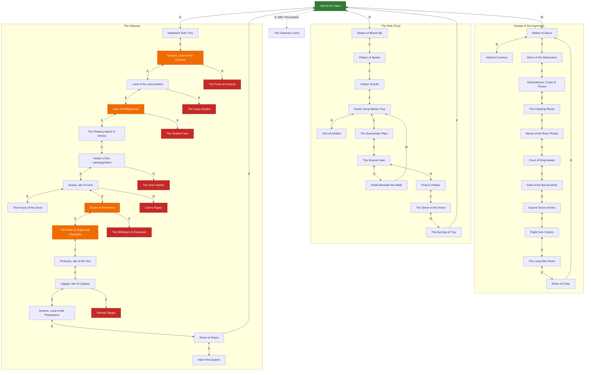

*This project has been created as part of the 42 curriculum by amakino, takawaka.*

# The Answer Protocol (TAP)

[English](#english) ・ [日本語版](#日本語版)

---

# English

## Description

**The Answer Protocol (TAP)** is a multiplayer text adventure (MUD): one TCP server (`cmd/server`), a CLI client (`cmd/cli`) and a GUI client (`cmd/gui`, Fyne), all written in Go. The server and the clients follow RFC 42TAP (`protocol-rfc.html`), so they work with other teams' implementations.

The world is three Greek myths (the Argonauts, the Iliad, the Odyssey), one arc each, around one hub, the Hall of the Fates. The RFC leaves combat open, so we built one idea on top of it: **acting against the myth gets you killed.** Attacking Polyphemus without the sharpened olive stake is an instant kill, not a fight.

## Instructions

Requires Go 1.25 or newer. Run everything from the repository root (the server reads `data/world.json` and writes `saves/`). The GUI also needs a C compiler and the OpenGL/X11 development packages on Linux (a Fyne requirement). Full commands are in [Building and Running](#building-and-running).

```sh
make run-server        # terminal 1: the server on :4242
make run-client        # terminal 2: the CLI client
make run-client-gui    # or the GUI client
```

**CLI choice.** The CLI is a **raw relay**: what you type is sent unchanged and every server line is printed unchanged (approach 1 of the subject), so you see exactly what is on the wire. Type `CONNECT <name>` first.

Commands: all 15 RFC commands (`CONNECT LOOK MOVE TAKE DROP INVENTORY TALK ATTACK STATUS QUEST QUESTS CHAT WHO GROUP QUIT`, see RFC section 5) plus `FLEE`, `DEFEND` (combat) and `LANG <en|ja>` (story language, before `CONNECT`).

```
OK hello proto=1
CONNECT alice
OK connected
MOVE east
OK room=loc.ody_troy_shore
STATUS
OK {"hp":100,"max_hp":100,"status":"healthy"}
```

## Resources

- RFC 42TAP (`protocol-rfc.html`), [RFC 2119](https://www.rfc-editor.org/rfc/rfc2119), [RFC 5234 (ABNF)](https://www.rfc-editor.org/rfc/rfc5234), [RFC 793 (TCP)](https://www.rfc-editor.org/rfc/rfc793), [RFC 3629 (UTF-8)](https://www.rfc-editor.org/rfc/rfc3629)
- Go: [Effective Go](https://go.dev/doc/effective_go), [`net`](https://pkg.go.dev/net), [`sync`](https://pkg.go.dev/sync), [`log/slog`](https://pkg.go.dev/log/slog), [`testing`](https://pkg.go.dev/testing)
- GUI toolkit: [Fyne](https://docs.fyne.io/). Diagrams: [Mermaid](https://mermaid.js.org/). Background: [MUD (Wikipedia)](https://en.wikipedia.org/wiki/MUD)
- **AI usage.** Claude Code (Anthropic) was used to read the subject and RFC, discuss the design, write and review Go code and tests for the game systems (combat, quests, hazards, endings, logging, localization), write the English/Japanese story text in `data/world.json`, write the documentation (this README and `memo/CODE_WALKTHROUGH.md`). The GUI artwork (rooms, NPCs, items and defeated enemies) was generated by takawaka with Codex. We reviewed, built and tested everything before committing, and each of us can explain the code we submit.

## Architecture

- **Dispatcher.** `server.go` has a table from command name to handler. `main.go` listens on `:4242`; each connection gets one goroutine that reads lines with `bufio.Scanner` and runs commands one at a time.
- **Concurrency.** All shared game state is guarded by one `sync.Mutex` (`Server.mu`). We chose it over an event loop because it is much simpler to keep correct; it will not scale to huge player counts, which is fine here. A second mutex serializes disk writes.
- **Non-blocking broadcast.** Each connection has an outbound queue drained by its own `writeLoop`, so a handler never writes to a socket while holding the lock, and one slow or dead client cannot stall the others. A disconnect removes the player state first, then broadcasts the leave events.
- **Data.** The world (rooms, items, NPCs, quests, hints) is `data/world.json`, validated at start-up (every exit and reference must exist). Player state is saved as JSON in `saves/` (not required by the subject).
- **Files** (`cmd/server`): `combat.go`, `quest.go`, `hazard.go`, `odyssey.go`, `endings.go`, `hardcore.go`, `item_effects.go`, `defeat.go`, `notify.go`, `flavor.go`, `locale.go`, `chat.go`, `group.go`, `world.go`, `room.go`, `player.go`, `item_store.go`, `player_store.go`, `logging.go`. A tour of every file is in `memo/CODE_WALKTHROUGH.md`.

## Protocol Implementation

All 15 RFC commands and the RFC events (`EVT ROOM/GLOBAL/GROUP ...`, `EVT STATS players=<n>`) are implemented with the RFC response and error shapes. Input is checked for valid UTF-8, control characters and the 1024-byte line limit; TCP splitting and coalescing are handled by buffering lines.

**Extensions** (additive; an RFC-only client can ignore them):

- `FLEE`, `DEFEND` (named as examples in RFC 6.1.1) and `LANG <en|ja>` (only before `CONNECT`, otherwise `ERR 400`); `ERR 407 NOT_IN_COMBAT` for `FLEE`/`DEFEND` outside a fight.
- `EVT ROOM COMBAT <text>` (combat narration) and `EVT PLAYER <kind> <text>` (a private message: `DEATH`, `ENDING`, `TEAM`, `GUIDE`, `HINT`, `QUEST`).

**Deviations and choices** (we document and justify each one):

| Where | RFC / subject says | We do | Why |
| --- | --- | --- | --- |
| `ATTACK` | for an "enemy NPC"; `405` for a non-enemy | Any NPC can be attacked. An ordinary person cannot fight back, but killing one kills you (`status: "murder"`); a god or sorceress kills you at once (`"smitten"`). `405` is only for an enemy already defeated. Other statuses: `combat`, `victory`, `dead`, `overwhelmed`, `wounded` | fits the "against the myth" idea |
| `LOOK` | fixed fields | an extra `defeated` array (NPCs you have beaten), left out when empty; `exits` can include a secret exit once you have finished the game | clients draw defeated enemies lying down |
| `QUEST` | `"reward"` is a string (`"gold_coin"`) | `"reward"` is an integer: the max-HP gain | our reward is max HP |
| `STATUS` | `max_hp` 100 in the example | `max_hp` starts at 100 and grows with quests (and carried items) | quest reward system |
| `WHO`, `TALK` | the subject's examples (V.5) show JSON bodies | we follow the RFC text: `OK players=<n>` and `OK <dialogue>` | the RFC is the formal protocol |

## Combat System

- **Numbers.** Start with 100 HP; HP regenerates 1 per 2 s; at 0 HP you respawn in the Hall with 20 HP. Max HP is raised by quests and kept after death.
- **Turns and initiative.** One `ATTACK` is one round and the player always acts first: your hit lands, and a surviving enemy counter-attacks in the same round. `DEFEND` and `FLEE` are the other actions of a round.
- **Damage.** Your hit = random 8-14 + 5 per ally in the room (max 3) + blessing/item bonuses (at least 1). The counter = random 7-14, lowered by 20% per ally, blessings, carried items and `DEFEND` (50%, once); total reduction is capped at 80%, bad items can raise it by at most 50%, and a counter is never below 1.
- **Myth gates.** Some enemies need an item or a finished quest (`myth_requirement_*` in the data). Without it `ATTACK` is an instant kill (Polyphemus needs the olive stake, Talos needs Medea's help, the suitors need Odysseus's bow).
- **FLEE.** Each enemy says whether fleeing matches the myth. Polyphemus and the Laestrygonians always allow it, most others fail with a counter-attack, Hector can be fled from once. The Laestrygonians cannot be beaten (`ATTACK` only costs crew), so there is no soft lock.
- **A live enemy blocks the room**: leaving a room with an enemy you neither beat nor fled from is an instant kill. Enemy HP is per player, and beaten enemies come back when you die.
- **People.** Ordinary NPCs do not fight back, but killing one ends your run. Mighty NPCs (gods, sorceresses) kill you at once. Both are signs of the design: you must not act against the myth.
- **Items and blessings.** Every item gives an effect only while carried (some good, some bad). Clearing an arc gives its god's blessing for good (Athena: counters -20%, Hera: double regeneration, Apollo: +3 damage).
- **Logging and broadcast.** Every fight result is logged and sent to the room as `EVT ROOM COMBAT`.

## Quest System

- `QUEST <npc>` starts that NPC's quest. The objective is `collect_item` or `defeat_npc` and progress is **automatic** (no completion command); progress made before accepting also counts. `QUESTS` lists every started quest with `"progress": "<current>/<target>"`.
- **Reward.** Finishing a quest raises your max HP by a fifth of its reward (at least 1) and fully heals you; the gain is kept after death.
- Quest givers announce themselves with `EVT PLAYER QUEST` when you enter their room or `TALK`, because `LOOK` only lists NPC IDs. After you beat every enemy in a room, its people say new lines.
- Some quests are traps: the cattle of Helios quest kills you if you do what it asks.
- **Endings.** Each arc has a final person (Pelias, Aeneas, Penelope) who checks your items and quests, plays the ending and gives a trophy. After all three, the Moirai play the true ending, and a secret room opens south of the Hall.

## World Design

- **Layout.** The hub (Hall of the Fates) has three exits: west to the Argonauts (12 rooms), north to the Iliad (11 rooms), east to the Odyssey (22 rooms). Every arc leads back to the hub, so the map is made of loops; the Odyssey is a ring with two dead-end branches. After the true ending, a secret exit leads to the Unwoven Loom. 47 rooms in total.
- **NPCs.** 44 NPCs with three roles: 16 `dialogue`, 16 `quest_giver`, 12 `enemy`. The Moirai in the Hall play a tutorial on first connect.
- **Items.** 21 items: 17 can be picked up, 4 are trophies given by endings.
  - **One-of-a-kind items (4).** The Woven Cloak of Lemnos, the Dragon's Teeth, the Honeyed Lotus Fruit and the Unwatered Wine exist **once in the whole world**. `TAKE` removes the item from the room, so nobody else can take it; `DROP` puts it back in the room for others. Where each unique item is, and who holds it, is saved and survives a server restart. If its holder dies, it is not lost: it goes back to the room where it first lay.
  - **Renewable items (13).** Items needed by a quest, a gate or an ending (for example the olive stake or the bow of Odysseus) are `renewable`: taking one gives **you** a copy and the original stays in the room. We chose this on purpose, so that one player carrying off a key item can never stop everyone else from finishing the game. This is the one place where we do not follow the subject's "no duplication" rule, and it only concerns items the story requires.
  - **Referencing.** Every item can be named by its ID or its display name, including names with several words.
- **Hazards** trigger on entering a room: `lethal`, `item_gate` (fatal without the item), `crew_gate`, `crew_cost`. At six points in the Odyssey the exit that goes against the myth leads to a game-over room.
- **Room map.** Generated from `data/world.json`. `<-->` is two-way, `-->` one-way, a dotted line opens after the true ending. Green is the hub, orange has a hazard, red is always fatal.



## Server Logging

Everything is logged as **structured JSON, one object per line** with `log/slog` (`cmd/server/logging.go`), with a precise timestamp and a level (INFO, WARN, ERROR), to stderr. `TAP_LOG_FILE=path` also writes a file; `TAP_LOG_LEVEL=debug|info|warn|error` filters.

| Required | Event (`msg`) | Level | Main fields |
| --- | --- | --- | --- |
| Connections / disconnections with IP | `connection_open`, `connection_close`, `player_quit` | INFO | `remote` (`ip:port`), `player`, `duration_ms` |
| Every command | `command` | INFO | `remote`, `player`, `command`, `args` |
| Every response and error code | `response`, `error_response` | INFO / WARN | `line`, `code`; logged where bytes are written (`writeLoop`), so none is missed |
| World state changes | `item_taken`, `item_dropped`, `player_moved`, `npc_interaction`, `combat_attack`, `combat_flee`, `player_died` | INFO | `player`, `item` / `npc` / `room`, `damage`, HPs, death `cause` |
| Quests | `quest_accepted`, `quest_progress`, `quest_completed`, `ending_reached` | INFO | `quest`, `progress`, `target`, `max_hp_gain` |
| Abuse patterns | `abuse_command_flood`, `abuse_rapid_connections` | WARN | see below |
| Failures | `save_player_failed`, `encode_response_failed`, ... | ERROR | `error` |

**Monitoring.** Write the log to a file and filter it, for example `TAP_LOG_FILE=server.log make run-server`, then `grep '"level":"WARN"' server.log`. Abuse is only logged, never punished: more than 20 commands in one second gives `abuse_command_flood`, and more than 8 connections from one IP in 10 seconds gives `abuse_rapid_connections`. Logging is one line per event written through a single logger, so it does not slow the game loop.

## Group Contributions


- **takawaka**: project skeleton; server core (accept loop, command dispatch, `CONNECT`/`LOOK`/`MOVE`); non-blocking send queue; `CHAT` and `GROUP`; item and player persistence; the server tests; the **CLI client**; the **GUI client** foundation (protocol/state model, Japanese font, rendering, mouse controls, responsive layout); the **artwork** (rooms, NPCs, items, game-over rooms, defeated enemies); GUI and server bug fixes.
- **amakino**: subject and RFC analysis; **world and story** (three arcs, English and Japanese, `data/world.json`); **game systems** (combat `ATTACK`/`FLEE`/`DEFEND`, quests, hazards, crew, myth gates, endings and blessings, death penalty and co-op, hints, localization `LANG`, item effects, secret room); **structured logging**; the **Makefile**; many GUI features (HP bars, colored story log, combat panel, minimap, flashes, endings gallery, item descriptions); integration tests; README and `memo/`.

## Building and Running

A `Makefile` wraps everything (`make help` lists the targets). Run from the repository root.

| Target | What it does |
| --- | --- |
| `make install` | download the Go module dependencies |
| `make build` | compile the server, CLI and GUI into `bin/` |
| `make run-server` | run the server on `:4242` |
| `make run-client` | run the CLI client (`make run-client ADDR=host:port` for another server) |
| `make run-client-gui` | run the GUI client |
| `make lint` | fail if a file needs `gofmt`, then `go vet ./...` |
| `make test` | run all automated tests |
| `make clean` | remove `bin/` (`saves/` is kept) |

Without `make`: `go run ./cmd/server`, `go run ./cmd/cli 127.0.0.1:4242`, `go run ./cmd/gui`, `go vet ./... && gofmt -l .`.

## Testing

```sh
make test                       # go test ./...  (server, CLI and GUI)
go test -race ./cmd/server/...  # with the race detector
go test ./cmd/server/... -run TestName -v
```

The automated tests cover the connection lifecycle and persistence, the success and error paths of every command, TCP splitting, concurrent clients, world validation, and every myth gate and hazard against the real `data/world.json` in English and Japanese.

**Manual test, multiplayer, combat and quest** (two terminals running `make run-client`, one server):

1. Terminal A `CONNECT alice`, terminal B `CONNECT bob`. Both see `EVT STATS players=2`. `CHAT GLOBAL hello` reaches both; `WHO` answers `OK players=2`.
2. `GROUP CREATE` (alice), `GROUP INVITE bob`, then `GROUP JOIN alice` (bob), `CHAT GROUP hi`: both receive `EVT GROUP ...`.
3. Alice `MOVE west`: bob receives `EVT ROOM PRESENCE LEAVE alice`. At the Harbor of Iolcus alice is told of a quest.
4. **Quest and combat.** Alice `QUEST Tiphys`, `MOVE south`, then `ATTACK King Amycus` until `"status":"victory"` (each hit 8-14, each counter 7-14, `STATUS` shows your HP). The quest completes by itself and `STATUS` now shows `"max_hp":103`; `QUESTS` shows it as `completed`; a further `ATTACK King Amycus` gives `ERR 405 NPC_NOT_HOSTILE`.
5. Close bob's terminal (Ctrl-C): alice receives `EVT GROUP LEAVE bob` and `EVT STATS players=1`. The server saves and removes the player's state before it sends the leave events.
6. Edge cases: `FROB` gives `ERR 400 BAD_REQUEST`, `MOVE up` gives `ERR 301 NO_EXIT`, `ATTACK` on a missing NPC gives `ERR 404 NPC_NOT_FOUND`.

---

# 日本語版

## 動かし方

```sh
# サーバー起動(ポート4242で待ち受け、Ctrl-Cで終了)
go run ./cmd/server            # または make run-server

# 別ターミナルでCLIクライアント接続(デフォルトは127.0.0.1:4242)
go run ./cmd/cli               # または make run-client
go run ./cmd/cli 127.0.0.1:4242   # ホスト:ポートを指定する場合

# GUIクライアント
go run ./cmd/gui               # または make run-client-gui

# バイナリとしてビルドする場合
make build                     # bin/ にサーバー・CLI・GUIが出来る
```

CLIは「生プロトコルをそのまま中継する」方針(打った行がそのままサーバーに送られ、サーバーの応答行がそのまま表示される)。最初のコマンドは必ず`CONNECT <name>`。日本語版で遊びたい場合は、`CONNECT`より前に`LANG ja`を送る。

```
$ go run ./cmd/cli
Connected to 127.0.0.1:4242
OK hello proto=1
LANG ja
OK lang=ja
CONNECT alice
OK connected
LOOK
OK {"room":{...,"name":"運命の間",...}, ...}
```

## コマンド一覧

RFC 15コマンド + 独自拡張3つ(`FLEE`・`DEFEND`・`LANG`、下表に明記)。正式な仕様は`protocol-rfc.html` 5章、英語セクションの[Instructions](#instructions)も参照。

| コマンド | 構文 | 内容 |
|---|---|---|
| `CONNECT` | `CONNECT <name>` | `<name>`で認証。`LANG`を送る場合を除き最初に送るコマンド。 |
| `LANG`(独自) | `LANG <en\|ja>` | このコネクションのストーリー言語を選択。**`CONNECT`より前**に送ること。 |
| `LOOK` | `LOOK` | 現在の部屋(名前・説明・プレイヤー・アイテムID・NPC ID・出口)を取得。倒した敵がいれば`defeated`も付く。 |
| `MOVE` | `MOVE <方向>` | 出口を通って移動(例: `MOVE east`)。 |
| `TAKE` | `TAKE <アイテムIDまたは名前>` | 部屋にあるアイテムを取得。 |
| `DROP` | `DROP <アイテムIDまたは名前>` | 所持品を部屋に置く。 |
| `INVENTORY` | `INVENTORY` | 所持品一覧。 |
| `TALK` | `TALK <NPC IDまたは名前>` | 部屋にいるNPCと話す。 |
| `ATTACK` | `ATTACK <NPC IDまたは名前>` | NPCを攻撃。敵とは戦闘になる。敵以外も攻撃できるが、一般人は反撃しない代わりに殺すと自分が死に、神や魔女などは一撃で自分が殺される。 |
| `FLEE`(独自) | `FLEE` | 現在の戦闘から離脱。戦闘中のみ有効。 |
| `DEFEND`(独自) | `DEFEND` | 攻撃せずに身構える。ダメージは与えないが、次の反撃が半分になる。戦闘中のみ有効。 |
| `STATUS` | `STATUS` | 自分のHP・最大HP・戦闘状態を確認。 |
| `QUEST` | `QUEST <NPC IDまたは名前>` | そのNPCが持つクエストを受注。 |
| `QUESTS` | `QUESTS` | これまで受注した全クエストと進行状況を一覧表示。 |
| `CHAT` | `CHAT <GLOBAL\|ROOM\|GROUP> <メッセージ>` | 指定した範囲にチャット送信。 |
| `WHO` | `WHO` | 現在の接続プレイヤー数(`OK players=<n>`)。 |
| `GROUP` | `GROUP CREATE` / `GROUP INVITE <name>` / `GROUP JOIN <leader>` / `GROUP LEAVE` | `CHAT GROUP`用のグループ管理。 |
| `QUIT` | `QUIT` | 正常に切断する。 |

## テストの実行

```sh
make lint             # gofmtとgo vet(何も出なければOK)
make test             # go test ./...
go test -race ./cmd/server/...
```

特定のテストだけ実行したいとき:
```sh
go test ./cmd/server/... -run TestOdysseyArcAgainstRealWorldData -v
```

複数人での動作・戦闘・クエストを手で確かめる手順は、英語セクションの[Testing](#testing)にある(CLIを2つ起動して、チャット・グループ・移動イベント・`QUEST Tiphys`→`ATTACK King Amycus`でのクエスト達成と最大HP上昇・切断時の後始末を確認する)。

## 各システムの概要

英語セクションの各見出し([Architecture](#architecture)、[Protocol Implementation](#protocol-implementation)、[Combat System](#combat-system)、[Quest System](#quest-system)、[World Design](#world-design)、[Server Logging](#server-logging))に詳しく書いてあるので、ここでは要点だけ:

- **並行モデル**: 接続ごとに1 goroutine + サーバー状態全体を単一の`sync.Mutex`で保護、という単純な方式。実装の正しさを優先した。コード全体の解説は`memo/CODE_WALKTHROUGH.md`。
- **戦闘**: ATTACKは基本8〜14ダメージ・反撃7〜14ダメージのランダム。一部の敵は「正しいアイテム/達成済みクエスト」を持っていないとATTACKで即死する「神話ゲート」付き。HP0で運命の間にHP20でリスポーン。**生きている敵がいる部屋はMOVEで出ようとすると即死**(倒すかFLEEで振り切るまで封鎖)。**DEFEND**で身構えると次の反撃が半分になる(1回限り)。死んだあとモイライに`TALK`すると、死因について神話にちなんだ控えめなヒントを1回だけくれる(`EVT PLAYER HINT`)。**祝福**: 各編をクリア(エンディング)すると、その編の神の祝福が永続で手に入る(死んでも消えない)。アテナ(オデュッセイア編)=敵の反撃-20%、ヘラ(アルゴ船編)=HP回復2倍、アポロン(トロイア編)=与ダメージ+3。
- **敵以外への攻撃**: 一般人にもATTACKできる。反撃はしないが、HPを0にした瞬間に自分が死ぬ(ゲームオーバー扱い)。メデイア・キルケー・アテナ・モイライなど強いキャラ(`mighty`)は、攻撃すると一撃で殺される。
- **倒した敵の表示と人物のセリフ**: 倒した敵はGUIで倒れた絵に変わる(`LOOK`の`defeated`)。その部屋の敵を全部倒すと、そこにいる人物が別のセリフを話す(`dialogue_cleared`)。死ぬと敵は元に戻る。
- **クエスト**: `QUEST <npc>`で受注、TAKE/ATTACKの成否をサーバー側が自動で判定して進行・達成・報酬付与まで行う(完了報告コマンドは無し)。報酬は**最大HPの上昇**(報酬値の1/5、最低1)で、HPも全回復する。上がった最大HPは死んでも失わない。
- **アイテムの効果**: 全アイテムに、持っている間だけ効く効果がある(与ダメージ・被ダメージ・回復速度・最大HP)。良い効果も悪い効果もある。祝福とは別の仕組みで、GUIの持ち物に緑(良)・赤(悪)で表示され、ⓘボタンで解説も読める。
- **ワールド**: 47部屋・アイテム21種(取得できるもの17種+記念品4種)・NPC 44・クエスト16種。ハブ(運命の間)からは西のアルゴナウタイ編(12部屋)・北のトロイア編(11部屋)・東のオデュッセイア編(22部屋)の3編に行ける。オデュッセイア編は単独で輪になっていて(ハブから東へ進み、イタケの岸辺の東の出口でハブに戻る14部屋)、冥界と求婚者たちの広間はそこから分かれる行き止まりの枝なので、「ループ+分岐、一直線不可」の要件を満たす。さらに、史実に反する選択(キコネスの宴に居座る、蓮の園に残る、眠るポリュペモスを刺す、ライストリュゴネスの港の奥へ入る、キルケーの食卓につく、カリュプソの不死を受け入れる)をすると入るゲームオーバー部屋が6つある。3編をクリアして最終エンディングを見ると、運命の間の南に隠し部屋「織られざる機」が開く。
- **アイテムの扱い**: アイテム21種のうち、**一点物が4つ**(レムノスの織り布のマント・竜の歯・ロトスの実・薄めていない葡萄酒)。世界に1つしか無く、`TAKE` すると部屋から消えるので、他の人は取れない。`DROP` すると部屋に戻り、他の人が取れる。誰が持っているか・どこにあるかは保存され、サーバーを再起動しても残る。持ち主が死んでも失われず、**最初に置いてあった部屋に戻る**。一方、クエスト・関門・エンディングに必要な13種は`renewable`で、拾うと**自分用の複製**が手に入り、元は部屋に残る。1人が持ち去って、他の全員が先へ進めなくなるのを防ぐための意図的な設計(課題の「複製しない」から外れるのは、物語に必須のアイテムだけ)。アイテムはIDでも表示名でも指定でき、複数語の名前も使える。
- **多言語対応**: `LANG ja`をCONNECT前に送るとLOOK/TALK/QUESTのテキストが日本語になる。RFC規定のコマンド名・基本のJSON構造は変更していない(独自の拡張と変更点は英語セクションの[Protocol Implementation](#protocol-implementation)の表にまとめた)。

### ワールドの地図

全47部屋とその出口を `data/world.json` から生成した図。アルゴナウタイ編・トロイア編・オデュッセイア編のどれも、ハブとの間を往復できる道でつながっている。矢印の文字は、上の部屋から下の部屋へ進むときの方角(戻るときは逆方向)。`<-->` は往復できる道、`-->` は一方通行(クレタ→イオルコス、城壁の下の野→ギリシア軍の陣営、イタケの岸辺→運命の間、トロイア炎上→運命の間)、点線は最終エンディングのあとに開く道。緑がハブ、橙は仲間を失う/適切なアイテムが無いと死ぬ危険のある部屋、赤は入ると必ず死ぬ部屋。


## チーム分担

- **takawaka**: プロジェクトの土台、サーバーの中核(TCP受付・行単位ディスパッチ、CONNECT/LOOK/MOVE)、非同期送信キュー、CHATとGROUP、アイテム・プレイヤーの永続化、サーバーのテスト、**CLIクライアント**、**GUIクライアント**の土台(通信・状態モデル、日本語フォント、描画、マウス操作、レスポンシブなレイアウト)、**イラスト**(部屋・NPC・アイテム・ゲームオーバー部屋・倒された敵)、GUIとサーバーの不具合修正
- **amakino**: 課題とRFCの分析、**ワールド・ストーリー設計**(3編・英日2言語・`data/world.json`)、**ゲームシステム**(戦闘ATTACK/FLEE/DEFEND、クエスト、ハザード、クルー、神話ゲート、エンディングと祝福、死亡ペナルティと協力、ヒント、`LANG`による多言語対応、アイテム効果、隠し部屋)、**構造化ログ**、**Makefile**、GUIの機能(HPバー・色分けログ・戦闘パネル・ミニマップ・演出・エンディング図鑑・アイテム解説)、結合テスト、READMEと`memo/`
