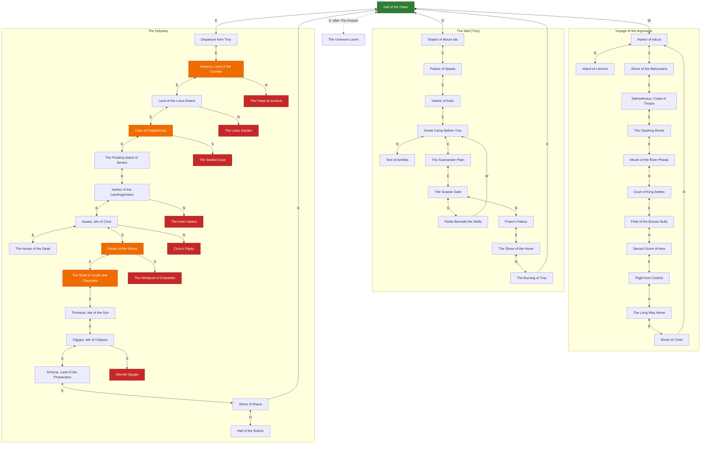

*This project has been created as part of the 42 curriculum by amakino, takawaka.*

# The Answer Protocol (TAP)

[English](#english) ・ [日本語版は下にあります (Japanese version below)](#日本語版)

---

# English

## Description

**The Answer Protocol (TAP)** is a multiplayer text adventure (MUD): one TCP server (`cmd/server`), a CLI client (`cmd/cli`) and a GUI client (`cmd/gui`, Fyne), built strictly against the RFC (`protocol-rfc.html`) so that they interoperate with any other team's implementation.

The world is three Greek myths (the Argonauts, the Iliad, the Odyssey) as three arcs around one hub, the Hall of the Fates. The RFC leaves combat open, so we built one idea on top of it: **acting against the myth gets you killed.** Attacking Polyphemus without the sharpened olive stake is an instant kill, not a fight.

Known limitation: a few GUI illustrations are placeholders.

## Instructions

The server listens on TCP port 4242 and speaks the line-based TAP protocol. The CLI is a **raw relay**: what you type is sent unchanged and what the server sends is printed unchanged, so you can see exactly what is on the wire. See "Building and Running" to start them.

### Command list

All 15 RFC commands plus three additive extensions (`FLEE`, `DEFEND`, `LANG`). Exact shapes are in `protocol-rfc.html` §5.

| Command | Syntax | What it does |
|---|---|---|
| `CONNECT` | `CONNECT <name>` | Authenticate as `<name>`. Must be the first command after `LANG` (if any). |
| `LANG` *(custom)* | `LANG <en\|ja>` | Choose the story language for this connection. Must be sent **before** `CONNECT`. |
| `LOOK` | `LOOK` | Current room: name/description, players, item IDs, NPC IDs, exits. |
| `MOVE` | `MOVE <direction>` | Move through an exit (e.g. `MOVE east`). |
| `TAKE` | `TAKE <item id or name>` | Pick up an item present in the room. |
| `DROP` | `DROP <item id or name>` | Drop an item from your inventory into the room. |
| `INVENTORY` | `INVENTORY` | List the items you're carrying. |
| `TALK` | `TALK <npc id or name>` | Talk to an NPC in the room. |
| `ATTACK` | `ATTACK <npc id or name>` | Attack an enemy NPC. |
| `FLEE` *(custom)* | `FLEE` | Retreat from your current fight. Only valid while in combat. |
| `DEFEND` *(custom)* | `DEFEND` | Brace instead of attacking: you deal no damage, but the next counter-attack is halved. Only valid while in combat. |
| `STATUS` | `STATUS` | Your current HP and combat status. |
| `QUEST` | `QUEST <npc id or name>` | Request the quest offered by that NPC. |
| `QUESTS` | `QUESTS` | List every quest you've started, with progress. |
| `CHAT` | `CHAT <GLOBAL\|ROOM\|GROUP> <message>` | Send a chat message in that scope. |
| `WHO` | `WHO` | Number of players currently online. |
| `GROUP` | `GROUP CREATE` / `GROUP INVITE <name>` / `GROUP JOIN <leader>` / `GROUP LEAVE` | Party management for `CHAT GROUP`. |
| `QUIT` | `QUIT` | Disconnect cleanly. |

```
OK hello proto=1
CONNECT alice
OK connected
MOVE east
OK room=loc.ody_troy_shore
STATUS
OK {"hp":100,"max_hp":100,"status":"healthy"}
```

For the Japanese story, send `LANG ja` **before** `CONNECT`. Only story text changes; commands are identical.

## Resources

- The "42TAP" RFC: `protocol-rfc.html`. Go standard library only (`go.mod` has no third-party dependencies except the GUI toolkit).
- **AI assistance**: Claude (Anthropic) helped read the subject and RFC, design the combat/quest/hazard systems, write the corresponding Go code and tests, write the Japanese text in `data/world.json`, and write this README. The team reviewed, built and tested everything before committing.

## GUI client

The GUI sends exactly the commands a CLI player would. It shows HP and crew bars, a colour-coded Adventure log, a combat panel (enemy HP, Attack / Brace / Flee), a minimap of visited rooms, an endings gallery (with blessings and fatal choices found), short screen flashes on damage, travel and death, and supports mouse and a responsive layout.

## Architecture

- **Dispatch**: `server.go` maps each command to a handler. `main.go` listens on `:4242` and starts one goroutine per connection, which reads lines with `bufio.Scanner` and runs commands one at a time.
- **Concurrency**: all shared game state is guarded by one `sync.Mutex` (`Server.mu`). We chose this over an event loop because it is much simpler to keep correct; it will not scale to huge player counts, which is fine for this project. A second mutex (`ioMu`) serializes disk writes so I/O never blocks game state.
- **Non-blocking broadcast**: each connection has an outbound queue drained by its own `writeLoop`, so handlers never write to a socket while holding `Server.mu` and one slow client cannot stall the others.
- **Files**: `combat.go` (ATTACK/FLEE/DEFEND), `quest.go`, `hazard.go` (room hazards), `odyssey.go` (Odyssey item effects and crew), `endings.go` (endings and blessings), `hardcore.go` (death penalty, co-op), `notify.go` (private `EVT PLAYER` events), `flavor.go` (combat narration), `locale.go` (`LANG`), `chat.go`/`group.go`, `world.go`/`room.go`/`player.go` (data model and validation), `item_store.go`/`player_store.go` (persistence).

## Protocol Implementation

All 15 RFC commands are implemented with the RFC's response and error shapes. Input is checked for valid UTF-8, control characters and the 1024-byte line limit, and TCP splitting/coalescing is handled by buffering rather than assuming one read is one command.

Our extensions are all **additive**: no RFC command, response or event changes, so RFC-only clients and servers still interoperate.

- **`FLEE`**: leave your current fight (the RFC names it as an example extension, §6.1.1).
- **`DEFEND`**: brace instead of attacking. Answers `OK {"hp":<n>,"result":"braced"}`, deals no damage and halves the next counter-attack (once).
- **`LANG <en|ja>`**: before `CONNECT` only; sets the story language. After `CONNECT` it returns `ERR 400`.
- **`EVT ROOM COMBAT <text>`**: combat narration for everyone in the room.
- **`EVT PLAYER <kind> <text>`**: a message to one player: `DEATH` (what killed you, what you lost), `ENDING`, `TEAM`, `GUIDE` (the Hall tutorial), `HINT` (see below) or `QUEST`. Clients that do not know it can ignore it.
- **`ERR 407 NOT_IN_COMBAT`**: returned by `FLEE` and `DEFEND` outside a fight.
- No new fields were added to any RFC JSON body; the internal crew count is only ever shown as narration.

## Combat System

The RFC leaves damage, turns and extra commands to each team. Ours:

- **Numbers.** 100 HP. A hit deals 8-14 damage; a surviving enemy counters for 7-14. Death respawns you in the Hall with 20 HP; HP regenerates 1 per 2 s.
- **Myth gates.** Some enemies require a specific item or completed quest (`myth_requirement_*` in `data/world.json`). Without it, `ATTACK` is an instant kill (Polyphemus needs the olive stake, Talos needs Medea's help, the suitors need Odysseus's bow).
- **FLEE.** Each enemy says whether fleeing is myth-accurate. Polyphemus and the Laestrygonians always allow it; most fail with a counter-attack; Hector can be fled from exactly once. A successful flee is remembered per player.
- **Unwinnable enemies.** The Laestrygonians cannot be beaten: `ATTACK` only costs crew and `FLEE` always works, so there is no softlock (`TestNoEnemyIsBothUnwinnableAndUnfleeable`).
- **A live enemy blocks the room.** `MOVE` out of a room with an enemy you have not beaten or fled from is an instant kill.
- **DEFEND.** A round spent bracing deals no damage but halves the next counter. Total damage reduction (DEFEND + allies + blessing) is capped at 80%.

## Quest System

- `QUEST <npc>` starts the NPC's quest; objectives are `collect_item` or `defeat_npc` and progress is **automatic** (no completion command). Completion raises your max HP by a fifth of the quest's reward (kept after death) and fully heals you. Progress you made before accepting also counts.
- `QUESTS` lists every started quest as `"progress": "<current>/<target>"`.
- Quest givers are announced with `EVT PLAYER QUEST` on entry and after `TALK`, since `LOOK` only lists NPC IDs.
- Some quests are traps: the cattle of Helios quest kills you if you do what it asks.

## Endings, Difficulty and Co-op

- **Endings.** Each arc has a final person to `TALK` to, who checks your items and completed quests, plays the ending and gives a trophy: Pelias (Argonauts), Aeneas (Troy), Penelope (Odyssey). After all three, the Moirai play the final ending. If something is missing they only refuse and never say what.
- **Blessings.** Clearing an arc earns its god's blessing for good, even through death: **Athena** (Odyssey) cuts enemy counters by 20%, **Hera** (Argonauts) doubles HP regeneration, **Apollo** (Iliad) adds 3 damage per hit.
- **Brutal difficulty.** Death costs every belonging except trophies and heals every enemy you wounded. Quest and death texts contain no hints. The one opt-in exception: after a death, `TALK` to the Moirai once for a single vague myth line about what killed you (`EVT PLAYER HINT`, data in `hints` in `data/world.json`).
- **Shared world.** Items needed by a quest, gate or ending are `renewable` (each player gets a copy), and enemy HP is per player, so nobody can block anyone else.
- **Co-op.** In the same `GROUP` and room, each ally adds +5 damage and cuts counters by 20% (up to 3 allies); kills count for everyone; and allies protect your belongings if you die.

## World Design

- **Structure.** The hub has three exits: west to the Argonauts (12 rooms), north to the Iliad (11 rooms), east to the Odyssey (22 rooms, six of them game-over rooms). The Odyssey forms a ring (hub, every stop, Ithaca, back to the hub) with two dead-end branches, so the world is not a straight line.
- **NPCs, items, quests.** Over 30 NPCs with all three roles (`dialogue`, `quest_giver`, `enemy`); 17 obtainable items plus 4 trophies; 16 quests.
- **Guide.** The Moirai in the Hall play a tutorial on first connect (`EVT PLAYER GUIDE`); `TALK` replays it.
- **Hazards** (`hazard.go`) trigger on entering a room: `lethal` (always fatal), `item_gate` (fatal without an item, e.g. the Sirens without beeswax), `crew_gate` (costs crew, fatal if too few, e.g. Scylla) and `crew_cost` (costs crew, never fatal).
- **Wrong turns.** At six points in the Odyssey the exit that goes against the myth leads to a `lethal` game-over room.
- **Crew** (Odyssey only). You start with 12 companions, spent by bad choices (e.g. -6 at Scylla). It is never put in RFC JSON.
- **Circe and the Sirens** trigger on engagement, not entry, because the moly that protects against Circe lies inside her room.

### Room map

All rooms and exits, generated from `data/world.json`. `<-->` is two-way, `-->` one-way. Green is the hub, orange rooms have a hazard, red rooms are always fatal.



## Server Logging

Everything is logged as **structured JSON, one object per line** with `log/slog` (`cmd/server/logging.go`), to stderr. Set `TAP_LOG_FILE=path` to also write a file and `TAP_LOG_LEVEL=debug|info|warn|error` to filter.

| What the subject requires | Event (`msg`) | Level | Main fields |
| --- | --- | --- | --- |
| Connections and disconnections with timestamps and IP | `connection_open`, `connection_close`, `player_quit` | INFO | `remote` (`ip:port`), `player`, `duration_ms` |
| Every command received | `command` | INFO | `remote`, `player` (empty before `CONNECT`), `command`, `args` (clipped to 300 characters) |
| Every response and error code sent | `response` (`OK ...`), `error_response` (`ERR ...`) | INFO / WARN | `remote`, `player`, `command`, `code` (errors), `line`. Logged at the single point where bytes are written (`writeLoop`), so no response can be missed |
| World state changes | `item_taken`, `item_dropped`, `player_moved`, `npc_interaction`, `combat_attack`, `combat_flee`, `player_died`, `victory_shared` | INFO | `player`, `item` / `npc` / `room`, combat `status`, `damage`, HPs, death `cause` and what happened to the belongings |
| Quest progress and completion | `quest_accepted`, `quest_progress`, `quest_completed`, `ending_reached` | INFO | `player`, `quest` / `ending`, `progress`, `target`, `max_hp_gain` |
| Abuse patterns | `abuse_command_flood`, `abuse_rapid_connections` | WARN | see below |
| Failures | `save_player_failed`, `drop_item_failed`, `encode_response_failed`, ... | ERROR | `error` |

**Abuse monitoring** only logs, it never disconnects: more than 20 commands in one second gives `abuse_command_flood`; more than 8 connections from one IP in 10 seconds gives `abuse_rapid_connections`.

## Group Contributions

Reconstructed from `git log`; please double-check and expand this section yourselves before final submission.

- **takawaka** built the initial server framework: the TCP accept loop and line-based command dispatch, `CONNECT`/`LOOK`/`MOVE`, `CHAT` (`GLOBAL`/`ROOM`/`GROUP`), `GROUP` management, item pickup/drop persistence (`item_store.go`, `player_store.go`), and the CLI client (`cmd/cli`), along with their test suites.
- **amakino** wrote the world/story content across all three arcs (`data/world.json`), the subject/RFC analysis notes (`TASKS.md`, `memo.md`), and designed and implemented the combat/quest/hazard/crew game systems (`combat.go`, `quest.go`, `hazard.go`, `odyssey.go`), the myth-gate data for every enemy/gated NPC, the `LANG`/localization system (`locale.go`) and the Japanese translations in `data/world.json`, and the corresponding automated tests.

## Building and Running

Run these from the repository root — the server loads `data/world.json` and reads/writes `saves/` using relative paths. A `Makefile` wraps everything (`make help` lists the targets):

| Target | What it does |
| --- | --- |
| `make install` | download the Go module dependencies (`go mod download`) |
| `make build` | compile the server, CLI client and GUI client into `bin/` |
| `make run-server` | run the server on `:4242` (JSON logs on stderr) |
| `make run-client` | run the CLI client; `make run-client ADDR=host:port` for another server |
| `make run-client-gui` | run the GUI client |
| `make lint` | fail if any file needs `gofmt`, then run `go vet ./...` |
| `make test` | run all automated tests |
| `make clean` | remove `bin/` (the `saves/` directory is kept) |

The same commands without `make`:

```sh
go run ./cmd/server                    # starts the server on :4242
go run ./cmd/cli 127.0.0.1:4242        # CLI client (host:port optional)
go run ./cmd/gui                       # GUI client
go vet ./... && gofmt -l .             # lint (gofmt prints nothing if all is formatted)
```

## Testing

```sh
go test ./...                          # full suite
go test -race ./cmd/server/...         # with the race detector
go test ./cmd/server/... -run TestName -v
```

The server tests cover the connection lifecycle and persistence, every RFC command's success and error paths, TCP splitting, concurrent clients, world-data validation, and every myth gate and hazard against the real `data/world.json` in English and Japanese. The GUI tests cover the layout, mouse controls, combat panel, map and gallery.

---

# 日本語版


## 動かし方

```sh
# サーバー起動(ポート4242で待ち受け、Ctrl-Cで終了)
go run ./cmd/server

# 別ターミナルでCLIクライアント接続(デフォルトは127.0.0.1:4242)
go run ./cmd/cli
go run ./cmd/cli 127.0.0.1:4242   # ホスト:ポートを指定する場合

# バイナリとしてビルドする場合
go build -o server ./cmd/server && ./server
go build -o cli ./cmd/cli && ./cli
```

CLIは「生プロトコルをそのまま中継する」方針(打った行がそのままサーバーに送られ、サーバーの応答行がそのまま表示される)。最初のコマンドは必ず`CONNECT <name>`。日本語版で遊びたい場合は、`CONNECT`より前に`LANG ja`を送る(8章参照)。

```
$ go run ./cmd/cli
Connected to 127.0.0.1:4242
OK hello proto=1
LANG ja
OK lang=ja
CONNECT alice
OK connected
LOOK
OK {"room":{...,"name":"運命の間",...}, ...}
```

## コマンド一覧

RFC 15コマンド + 独自拡張3つ(`FLEE`・`DEFEND`・`LANG`、下表に明記)。正式な仕様は`protocol-rfc.html` 5章、英語セクションの[Command list](#command-list)も参照。

| コマンド | 構文 | 内容 |
|---|---|---|
| `CONNECT` | `CONNECT <name>` | `<name>`で認証。`LANG`を送る場合を除き最初に送るコマンド。 |
| `LANG`(独自) | `LANG <en\|ja>` | このコネクションのストーリー言語を選択。**`CONNECT`より前**に送ること。 |
| `LOOK` | `LOOK` | 現在の部屋(名前・説明・プレイヤー・アイテムID・NPC ID・出口)を取得。 |
| `MOVE` | `MOVE <方向>` | 出口を通って移動(例: `MOVE east`)。 |
| `TAKE` | `TAKE <アイテムIDまたは名前>` | 部屋にあるアイテムを取得。 |
| `DROP` | `DROP <アイテムIDまたは名前>` | 所持品を部屋に置く。 |
| `INVENTORY` | `INVENTORY` | 所持品一覧。 |
| `TALK` | `TALK <NPC IDまたは名前>` | 部屋にいるNPCと話す。 |
| `ATTACK` | `ATTACK <NPC IDまたは名前>` | 敵NPCを攻撃。 |
| `FLEE`(独自) | `FLEE` | 現在の戦闘から離脱。戦闘中のみ有効。 |
| `DEFEND`(独自) | `DEFEND` | 攻撃せずに身構える。ダメージは与えないが、次の反撃が半分になる。戦闘中のみ有効。 |
| `STATUS` | `STATUS` | 自分のHP・戦闘状態を確認。 |
| `QUEST` | `QUEST <NPC IDまたは名前>` | そのNPCが持つクエストを受注。 |
| `QUESTS` | `QUESTS` | これまで受注した全クエストと進行状況を一覧表示。 |
| `CHAT` | `CHAT <GLOBAL\|ROOM\|GROUP> <メッセージ>` | 指定した範囲にチャット送信。 |
| `WHO` | `WHO` | 現在の接続プレイヤー数。 |
| `GROUP` | `GROUP CREATE` / `GROUP INVITE <name>` / `GROUP JOIN <leader>` / `GROUP LEAVE` | `CHAT GROUP`用のグループ管理。 |
| `QUIT` | `QUIT` | 正常に切断する。 |

## テストの実行

```sh
go vet ./...
gofmt -l .            # 何も出なければOK
go test ./...
go test -race ./cmd/server/...
```

特定のテストだけ実行したいとき:
```sh
go test ./cmd/server/... -run TestOdysseyArcAgainstRealWorldData -v
```

## 各システムの概要

英語セクションの各見出し([Architecture](#architecture)、[Protocol Implementation](#protocol-implementation)、[Combat System](#combat-system)、[Quest System](#quest-system)、[World Design](#world-design)、[Server Logging](#server-logging))に詳しく書いてあるので、ここでは要点だけ:

- **並行モデル**: 接続ごとに1 goroutine + サーバー状態全体を単一の`sync.Mutex`で保護、という単純な方式。実装の正しさを優先した(`memo.md` 2章)。
- **戦闘**: ATTACKは基本8〜14ダメージ・反撃6〜12ダメージのランダム。一部の敵は「正しいアイテム/達成済みクエスト」を持っていないとATTACKで即死する「神話ゲート」付き。HP0で運命の間にHP20でリスポーン。**生きている敵がいる部屋はMOVEで出ようとすると即死**(倒すかFLEEで振り切るまで封鎖)。**DEFEND**で身構えると次の反撃が半分になる(1回限り)。死んだあとモイライに`TALK`すると、死因について神話にちなんだ控えめなヒントを1回だけくれる(`EVT PLAYER HINT`)。**祝福**: 各編をクリア(エンディング)すると、その編の神の祝福が永続で手に入る(死んでも消えない)。アテナ(オデュッセイア編)=敵の反撃-20%、ヘラ(アルゴ船編)=HP回復2倍、アポロン(トロイア編)=与ダメージ+3。
- **クエスト**: `QUEST <npc>`で受注、TAKE/ATTACKの成否をサーバー側が自動で判定して進行・達成・報酬付与まで行う(完了報告コマンドは無し)。
- **ワールド**: 46部屋・アイテム21種(取得できるもの17種+記念品4種)・NPC 43・クエスト16種。ハブ(運命の間)からは西のアルゴナウタイ編(12部屋)・北のトロイア編(11部屋)・東のオデュッセイア編(22部屋)の3編に行ける(全46部屋に到達できる)。オデュッセイア編は単独で輪になっていて(ハブから東へ進み、イタケの岸辺の東の出口でハブに戻る14部屋)、冥界と求婚者たちの広間はそこから分かれる行き止まりの枝なので、「ループ+分岐、一直線不可」の要件を満たす。さらに、史実に反する選択(キコネスの宴に居座る、蓮の園に残る、眠るポリュペモスを刺す、ライストリュゴネスの港の奥へ入る、キルケーの食卓につく、カリュプソの不死を受け入れる)をすると入るゲームオーバー部屋が6つある。
- **多言語対応**: `LANG ja`をCONNECT前に送るとLOOK/TALK/QUESTのテキストが日本語になる。RFC規定のJSON構造・コマンド名は一切変更していないので、他チームのサーバー/クライアントとの相互接続には影響しない。詳細は`memo.md` 8章。

### ワールドの地図

全40部屋とその出口を `data/world.json` から生成した図。アルゴナウタイ編とトロイア編も、ハブとの間を往復できる道でつながっている。矢印の文字は、上の部屋から下の部屋へ進むときの方角(戻るときは逆方向)。`<-->` は往復できる道、`-->` は一方通行(クレタ→イオルコス、城壁の下の野→ギリシア軍の陣営、イタケの岸辺→運命の間)。緑がハブ、橙は仲間を失う/適切なアイテムが無いと死ぬ危険のある部屋、赤は入ると必ず死ぬ部屋。


## チーム分担

- **takawaka**: サーバーの土台(TCP受付・行単位ディスパッチ、CONNECT/LOOK/MOVE、CHAT、GROUP、アイテムの永続化)とCLIクライアント
- **amakino**: ワールド・ストーリー設計、RFC/課題分析(`TASKS.md`/`memo.md`)、戦闘・クエスト・ハザード・クルーシステムの設計と実装、神話ゲートのデータ設計、多言語対応
