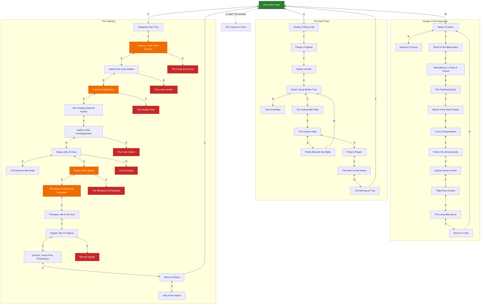
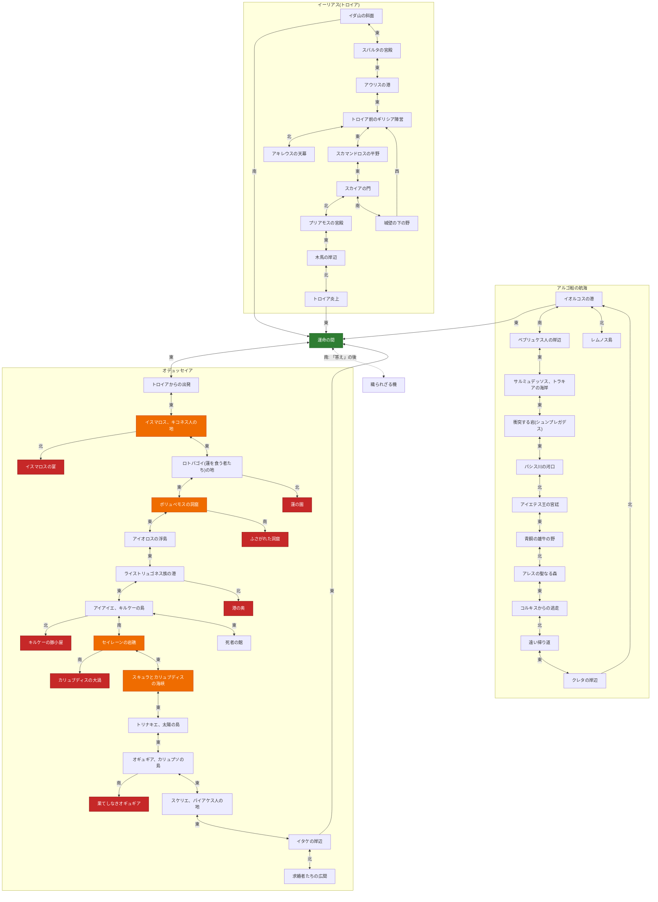

*This project has been created as part of the 42 curriculum by amakino, takawaka.*

# The Answer Protocol (TAP)

[English](#english) ・ [日本語版](#日本語版)

---

# English

## Description

**The Answer Protocol (TAP)** is a multiplayer text adventure (MUD): one TCP server (`cmd/server`), a CLI client (`cmd/cli`) and a GUI client (`cmd/gui`, Fyne), all written in Go. The server implements the 15 commands in RFC 42TAP (`protocol-rfc.html`). Our CLI can send raw commands to another team's server; extensions and the protocol differences listed below may limit some features across implementations.

The world is three Greek myths (the Argonauts, the Iliad, the Odyssey), one arc each, around one hub, the Hall of the Fates. The RFC leaves combat open, so we built one idea on top of it: **acting against the myth gets you killed.** Attacking Polyphemus without the sharpened olive stake is an instant kill, not a fight.

## Instructions

Requires Go 1.25 or newer. Run everything from the repository root (the server reads `data/world.json` and writes `saves/`). The GUI also needs a C compiler and the OpenGL/X11 development packages on Linux (a Fyne requirement). Full commands are in [Building and Running](#building-and-running).

```sh
make run-server        # terminal 1: the server on :4242
make run-client        # terminal 2: the CLI client
make run-client-gui    # or the GUI client
```

**CLI choice.** The CLI is a **raw relay**: what you type is sent unchanged and every server line is printed unchanged (approach 1 of the subject), so you see exactly what is on the wire. Start with `CONNECT <name>`, or send `LANG ja` first to choose Japanese.

Commands: all 15 RFC commands (`CONNECT LOOK MOVE TAKE DROP INVENTORY TALK ATTACK STATUS QUEST QUESTS CHAT WHO GROUP QUIT`, see RFC section 5) plus `FLEE`, `DEFEND` (combat), `LANG <en|ja>` (story language, before `CONNECT`) and `STATE` (crew and group state used by our GUI).

```
OK hello proto=1
CONNECT alice
OK connected
MOVE east
OK room=loc.ody_troy_shore
STATUS
OK {"hp":100,"max_hp":100,"status":"healthy"}
```

## Resources

- RFC 42TAP (`protocol-rfc.html`), [RFC 2119](https://www.rfc-editor.org/rfc/rfc2119), [RFC 5234 (ABNF)](https://www.rfc-editor.org/rfc/rfc5234), [RFC 793 (TCP)](https://www.rfc-editor.org/rfc/rfc793), [RFC 3629 (UTF-8)](https://www.rfc-editor.org/rfc/rfc3629)
- Go: [Effective Go](https://go.dev/doc/effective_go), [`net`](https://pkg.go.dev/net), [`sync`](https://pkg.go.dev/sync), [`log/slog`](https://pkg.go.dev/log/slog), [`testing`](https://pkg.go.dev/testing)
- GUI toolkit: [Fyne](https://docs.fyne.io/). Diagrams: [Mermaid](https://mermaid.js.org/). Background: [MUD (Wikipedia)](https://en.wikipedia.org/wiki/MUD)
- **AI usage.** Claude Code (Anthropic) was used to read the subject and RFC, discuss the design, write and review Go code and tests for the game systems (combat, quests, hazards, endings, logging, localization), write the English/Japanese story text in `data/world.json`, write the documentation (this README and `memo/CODE_WALKTHROUGH.md`). The GUI artwork (rooms, NPCs, items and defeated enemies) was generated by takawaka with Codex. We reviewed, built and tested everything before committing, and each of us can explain the code we submit.

## Architecture

- **Dispatcher.** `server.go` has a table from command name to handler. `main.go` listens on `:4242`; each connection gets one goroutine that reads lines with `bufio.Scanner` and runs commands one at a time.
- **Concurrency.** All shared game state is guarded by one `sync.Mutex` (`Server.mu`). We chose it over an event loop because it is simpler to keep correct; this design is not intended for large numbers of simultaneous players. A second mutex serializes disk writes.
- **Non-blocking broadcast.** Each connection has an outbound queue drained by its own `writeLoop`, so a handler never writes to a socket while holding the lock. A slow or disconnected client does not hold up broadcasts to the others. A disconnect removes the player state first, then broadcasts the leave events.
- **Data.** The world (rooms, items, NPCs, quests, hints) is `data/world.json`, validated at start-up (every exit and reference must exist). Player state is saved as JSON in `saves/` (not required by the subject).
- **Files** (`cmd/server`): `combat.go`, `quest.go`, `hazard.go`, `odyssey.go`, `endings.go`, `hardcore.go`, `item_effects.go`, `defeat.go`, `notify.go`, `flavor.go`, `locale.go`, `chat.go`, `group.go`, `world.go`, `room.go`, `player.go`, `item_store.go`, `player_store.go`, `logging.go`. A tour of every file is in `memo/CODE_WALKTHROUGH.md`.

## Protocol Implementation

All 15 RFC commands and the RFC events (`EVT ROOM/GLOBAL/GROUP ...`, `EVT STATS players=<n>`) are implemented with the RFC response and error shapes. Input is checked for valid UTF-8, control characters and the 1024-byte line limit; TCP splitting and coalescing are handled by buffering lines.

**Extensions** (additive; an RFC-only client can ignore them):

- `FLEE`, `DEFEND` (named as examples in RFC 6.1.1), `LANG <en|ja>` (only before `CONNECT`, otherwise `ERR 400`), and `STATE` (crew, player names, group and invitations for our GUI); `ERR 407 NOT_IN_COMBAT` for `FLEE`/`DEFEND` outside a fight.
- `EVT ROOM COMBAT <text>` (combat narration) and `EVT PLAYER <kind> <text>` (a private message: `DEATH`, `ENDING`, `TEAM`, `GUIDE`, `HINT`, `QUEST`).

**Deviations and choices** (we document and justify each one):

| Where | RFC / subject says | We do | Why |
| --- | --- | --- | --- |
| `ATTACK` | for an "enemy NPC"; `405` for a non-enemy | Any NPC can be attacked. An ordinary person cannot fight back, but killing one kills you (`status: "murder"`); a god or sorceress kills you at once (`"smitten"`). `405` is only for an enemy already defeated. Other statuses: `combat`, `victory`, `dead`, `overwhelmed`, `wounded` | fits the "against the myth" idea |
| `LOOK` | fixed fields | an extra `defeated` array (NPCs you have beaten), left out when empty; `exits` can include a secret exit once you have finished the game | clients draw defeated enemies lying down |
| `QUEST` | `"reward"` is a string (`"gold_coin"`) | `"reward"` is an integer: the max-HP gain | our reward is max HP |
| `STATUS` | `max_hp` 100 in the example | `max_hp` starts at 100 and grows with quests (and carried items) | quest reward system |
| `WHO`, `TALK` | the subject's examples (V.5) show JSON bodies | we follow the RFC text: `OK players=<n>` and `OK <dialogue>` | the RFC is the formal protocol |

## Combat System

- **Numbers.** Start with 100 HP; HP regenerates 1 per 2 s; at 0 HP you respawn in the Hall with 20 HP. Max HP is raised by quests and kept after death.
- **Turns and initiative.** One `ATTACK` is one round and the player always acts first: your hit lands, and a surviving enemy counter-attacks in the same round. `DEFEND` and `FLEE` are the other actions of a round.
- **Damage.** Your hit = random 8-14 + 5 per ally in the room (max 3) + blessing/item bonuses (at least 1). The counter = random 7-14, lowered by 20% per ally, blessings, carried items and `DEFEND` (50%, once); total reduction is capped at 80%, bad items can raise it by at most 50%, and a counter is never below 1.
- **Myth gates.** Some enemies need an item or a finished quest (`myth_requirement_*` in the data). Without it `ATTACK` is an instant kill (Polyphemus needs the olive stake, Talos needs Medea's help, the suitors need Odysseus's bow).
- **FLEE.** Each enemy says whether fleeing matches the myth. Polyphemus and the Laestrygonians always allow it, most others fail with a counter-attack, Hector can be fled from once. The Laestrygonians cannot be beaten (`ATTACK` only costs crew), so there is no soft lock.
- **A live enemy blocks the room**: leaving a room with an enemy you neither beat nor fled from is an instant kill. Enemy HP is per player, and beaten enemies come back when you die.
- **People.** Ordinary NPCs do not fight back, but killing one ends your run. Mighty NPCs (gods, sorceresses) kill you at once. Both are signs of the design: you must not act against the myth.
- **Items and blessings.** Every item gives an effect only while carried (some good, some bad). Clearing an arc gives its god's blessing for good (Athena: counters -20%, Hera: double regeneration, Apollo: +3 damage).
- **Logging and broadcast.** Every fight result is logged and sent to the room as `EVT ROOM COMBAT`.

## Quest System

- `QUEST <npc>` starts that NPC's quest. The objective is `collect_item` or `defeat_npc` and progress is **automatic** (no completion command). If you already hold the required item or have defeated the target when you accept a quest, it completes immediately. `QUESTS` lists every started quest with `"progress": "<current>/<target>"`.
- **Reward.** Finishing a quest raises your max HP by one fifth of `reward.hp` in `data/world.json` (at least 1) and fully heals you. The `QUEST` response's `reward` field already contains that final max-HP gain; the gain is kept after death.
- Quest givers announce themselves with `EVT PLAYER QUEST` when you enter their room or `TALK`, because `LOOK` only lists NPC IDs. After you beat every enemy in a room, its people say new lines.
- Some quests are traps: the cattle of Helios quest kills you if you do what it asks.
- **Endings.** Each arc has a final person (Pelias, Aeneas, Penelope) who checks your items and quests, plays the ending and gives a trophy. After all three, the Moirai play the true ending, and a secret room opens south of the Hall.

## World Design

- **Layout.** The hub (Hall of the Fates) has three exits: west to the Argonauts (12 rooms), north to the Iliad (11 rooms), east to the Odyssey (22 rooms). Every arc leads back to the hub, so the map is made of loops; the Odyssey is a ring with two dead-end branches. After the true ending, a secret exit leads to the Unwoven Loom. 47 rooms in total.
- **NPCs.** 44 NPCs with three roles: 16 `dialogue`, 16 `quest_giver`, 12 `enemy`. The Moirai in the Hall play a tutorial on first connect.
- **Items.** 21 items: 17 can be picked up, 4 are trophies given by endings.
  - **One-of-a-kind items (4).** The Woven Cloak of Lemnos, the Dragon's Teeth, the Honeyed Lotus Fruit and the Unwatered Wine exist **once in the whole world**. `TAKE` removes the item from the room, so nobody else can take it; `DROP` puts it back in the room for others. Where each unique item is, and who holds it, is saved and survives a server restart. If its holder dies without a group companion in the same room, it returns to the room where it first lay; otherwise the holder keeps it.
  - **Renewable items (13).** Items needed by a quest, a gate or an ending (for example the olive stake or the bow of Odysseus) are `renewable`: taking one gives **you** a copy and the original stays in the room. We chose this on purpose, so that one player carrying off a key item can never stop everyone else from finishing the game. This is the one place where we do not follow the subject's "no duplication" rule, and it only concerns items the story requires.
  - **Referencing.** Every item can be named by its ID or its display name, including names with several words.
- **Hazards** trigger on entering a room: `lethal`, `item_gate` (fatal without the item), `crew_gate`, `crew_cost`. At six points in the Odyssey the exit that goes against the myth leads to a game-over room.
- **Room map.** Generated from `data/world.json`. `<-->` is two-way, `-->` one-way, a dotted line opens after the true ending. Green is the hub, orange has a hazard, red is always fatal.



## Server Logging

Everything is logged as **structured JSON, one object per line** with `log/slog` (`cmd/server/logging.go`), with a precise timestamp and a level (INFO, WARN, ERROR), to stderr. `TAP_LOG_FILE=path` also writes a file; `TAP_LOG_LEVEL=debug|info|warn|error` filters.

| Required | Event (`msg`) | Level | Main fields |
| --- | --- | --- | --- |
| Connections / disconnections with IP | `connection_open`, `connection_close`, `player_quit` | INFO | `remote` (`ip:port`), `player`, `duration_ms` |
| Every command | `command` | INFO | `remote`, `player`, `command`, `args` |
| Every response and error code | `response`, `error_response` | INFO / WARN | `line`, `code`; logged where bytes are written (`writeLoop`), so none is missed |
| World state changes | `item_taken`, `item_dropped`, `player_moved`, `npc_interaction`, `combat_attack`, `combat_flee`, `player_died` | INFO | `player`, `item` / `npc` / `room`, `damage`, HPs, death `cause` |
| Quests | `quest_accepted`, `quest_progress`, `quest_completed`, `ending_reached` | INFO | `quest`, `progress`, `target`, `max_hp_gain` |
| Abuse patterns | `abuse_command_flood`, `abuse_rapid_connections` | WARN | see below |
| Failures | `save_player_failed`, `encode_response_failed`, ... | ERROR | `error` |

**Monitoring.** Write the log to a file and filter it, for example `TAP_LOG_FILE=server.log make run-server`, then `grep '"level":"WARN"' server.log`. Abuse is only logged, never punished: more than 20 commands in one second gives `abuse_command_flood`, and more than 8 connections from one IP in 10 seconds gives `abuse_rapid_connections`. A single logger writes one structured JSON line per event.

## Group Contributions


- **takawaka**: project skeleton; server core (accept loop, command dispatch, `CONNECT`/`LOOK`/`MOVE`); non-blocking send queue; `CHAT` and `GROUP`; item and player persistence; the server tests; the **CLI client**; the **GUI client** foundation (protocol/state model, Japanese font, rendering, mouse controls, responsive layout); the **artwork** (rooms, NPCs, items, game-over rooms, defeated enemies); GUI and server bug fixes.
- **amakino**: subject and RFC analysis; **world and story** (three arcs, English and Japanese, `data/world.json`); **game systems** (combat `ATTACK`/`FLEE`/`DEFEND`, quests, hazards, crew, myth gates, endings and blessings, death penalty and co-op, hints, localization `LANG`, item effects, secret room); **structured logging**; the **Makefile**; many GUI features (HP bars, colored story log, combat panel, minimap, flashes, endings gallery, item descriptions); integration tests; README and `memo/`.

## Building and Running

A `Makefile` wraps everything (`make help` lists the targets). Run from the repository root.

| Target | What it does |
| --- | --- |
| `make install` | download the Go module dependencies |
| `make build` | compile the server, CLI and GUI into `bin/` |
| `make run-server` | run the server on `:4242` |
| `make run-client` | run the CLI client (`make run-client ADDR=host:port` for another server) |
| `make run-client-gui` | run the GUI client |
| `make lint` | fail if a file needs `gofmt`, then `go vet ./...` |
| `make test` | run all automated tests |
| `make clean` | remove `bin/` (`saves/` is kept) |

Without `make`: `go run ./cmd/server`, `go run ./cmd/cli 127.0.0.1:4242`, `go run ./cmd/gui`, `go vet ./... && gofmt -l .`.

## Testing

```sh
make test                       # go test ./...  (server, CLI and GUI)
go test -race ./cmd/server/...  # with the race detector
go test ./cmd/server/... -run TestName -v
```

The automated tests cover the connection lifecycle and persistence, the success and error paths of every command, TCP splitting, concurrent clients, world validation, and every myth gate and hazard against the real `data/world.json` in English and Japanese.

**Manual test, multiplayer, combat and quest** (two terminals running `make run-client`, one server):

1. Terminal A `CONNECT alice`, terminal B `CONNECT bob`. Both see `EVT STATS players=2`. `CHAT GLOBAL hello` reaches both; `WHO` answers `OK players=2`.
2. `GROUP CREATE` (alice), `GROUP INVITE bob`, then `GROUP JOIN alice` (bob), `CHAT GROUP hi`: both receive `EVT GROUP ...`.
3. Alice `MOVE west`: bob receives `EVT ROOM PRESENCE LEAVE alice`. At the Harbor of Iolcus alice is told of a quest.
4. **Quest and combat.** Alice `QUEST Tiphys`, `MOVE south`, then `ATTACK King Amycus` until `"status":"victory"` (each hit 8-14, each counter 7-14, `STATUS` shows your HP). The quest completes by itself and `STATUS` now shows `"max_hp":103`; `QUESTS` shows it as `completed`; a further `ATTACK King Amycus` gives `ERR 405 NPC_NOT_HOSTILE`.
5. Close bob's terminal (Ctrl-C): alice receives `EVT GROUP LEAVE bob` and `EVT STATS players=1`. The server saves and removes the player's state before it sends the leave events.
6. Edge cases: `FROB` gives `ERR 400 BAD_REQUEST`, `MOVE up` gives `ERR 301 NO_EXIT`, `ATTACK` on a missing NPC gives `ERR 404 NPC_NOT_FOUND`.

---

# 日本語版

英語セクションと同じ内容の日本語訳(課題が求める各項目の見出しは、括弧内の英語名と対応している)。冒頭の「This project has been created as part of the 42 curriculum by amakino, takawaka.」の行はページ先頭にある。

## 概要(Description)

**The Answer Protocol(TAP)** は、複数人で遊ぶテキストアドベンチャー(MUD)。TCPサーバー1つ(`cmd/server`)、CLIクライアント(`cmd/cli`)、GUIクライアント(`cmd/gui`、Fyne)があり、すべてGoで書いた。サーバーはRFC 42TAP(`protocol-rfc.html`)の15コマンドを実装している。CLIは他チームのサーバーにも生のコマンドを送れるが、独自拡張や下記の仕様差がある機能は相互接続時に制限される場合がある。

世界は3つのギリシア神話(アルゴ船の航海・イーリアス・オデュッセイア)で、1つの神話が1つの「編」になっていて、ハブの「運命の間」でつながっている。RFCが戦闘の内容を定めていないため、**神話に逆らうと殺される**という方針で戦闘を設計した。研いだオリーブの杭なしでポリュペモスを攻撃すると、戦いにならず即死する。

## 使い方(Instructions)

Go 1.25以降が必要。リポジトリのルートで実行すること(サーバーは`data/world.json`を読み、`saves/`に書き込む)。GUIはLinuxではCコンパイラとOpenGL/X11の開発パッケージも必要(Fyneの要件)。起動・ビルドの詳細は[ビルドと実行](#ビルドと実行building-and-running)を参照。

```sh
make run-server        # ターミナル1: サーバー(:4242)
make run-client        # ターミナル2: CLIクライアント
make run-client-gui    # またはGUIクライアント
```

**CLIの方針.** CLIは「生プロトコルをそのまま中継する」方式(課題の方式1)。打った行がそのままサーバーに送られ、サーバーの応答行がそのまま表示されるので、通信の中身がそのまま見える。通常は`CONNECT <name>`から始める。日本語版で遊びたい場合は、その前に`LANG ja`を送る。

```
$ go run ./cmd/cli
Connected to 127.0.0.1:4242
OK hello proto=1
LANG ja
OK lang=ja
CONNECT alice
OK connected
LOOK
OK {"room":{...,"name":"運命の間",...}, ...}
```

### コマンド一覧

RFCの15コマンドと独自拡張4つ(`FLEE`・`DEFEND`・`LANG`・`STATE`)。RFCのコマンド仕様は`protocol-rfc.html` 5章。

| コマンド | 構文 | 内容 |
|---|---|---|
| `CONNECT` | `CONNECT <name>` | `<name>`で認証。`LANG`を送る場合を除き最初に送るコマンド。 |
| `LANG`(独自) | `LANG <en\|ja>` | このコネクションのストーリー言語を選択。**`CONNECT`より前**に送ること。 |
| `LOOK` | `LOOK` | 現在の部屋(名前・説明・プレイヤー・アイテムID・NPC ID・出口)を取得。倒した敵がいれば`defeated`も付く。 |
| `MOVE` | `MOVE <方向>` | 出口を通って移動(例: `MOVE east`)。 |
| `TAKE` | `TAKE <アイテムIDまたは名前>` | 部屋にあるアイテムを取得。 |
| `DROP` | `DROP <アイテムIDまたは名前>` | 所持品を部屋に置く。 |
| `INVENTORY` | `INVENTORY` | 所持品一覧。 |
| `TALK` | `TALK <NPC IDまたは名前>` | 部屋にいるNPCと話す。 |
| `ATTACK` | `ATTACK <NPC IDまたは名前>` | NPCを攻撃。敵とは戦闘になる。敵以外も攻撃できるが、一般人は反撃しない代わりに殺すと自分が死に、神や魔女などは一撃で自分が殺される。 |
| `FLEE`(独自) | `FLEE` | 現在の戦闘から離脱。戦闘中のみ有効。 |
| `DEFEND`(独自) | `DEFEND` | 攻撃せずに身構える。ダメージは与えないが、次の反撃が半分になる。戦闘中のみ有効。 |
| `STATUS` | `STATUS` | 自分のHP・最大HP・戦闘状態を確認。 |
| `STATE`(独自) | `STATE` | GUIで使う仲間の人数・接続中の名前・グループ・招待の状態を取得。 |
| `QUEST` | `QUEST <NPC IDまたは名前>` | そのNPCが持つクエストを受注。 |
| `QUESTS` | `QUESTS` | これまで受注した全クエストと進行状況を一覧表示。 |
| `CHAT` | `CHAT <GLOBAL\|ROOM\|GROUP> <メッセージ>` | 指定した範囲にチャット送信。 |
| `WHO` | `WHO` | 現在の接続プレイヤー数(`OK players=<n>`)。 |
| `GROUP` | `GROUP CREATE` / `GROUP INVITE <name>` / `GROUP JOIN <leader>` / `GROUP LEAVE` | `CHAT GROUP`用のグループ管理。 |
| `QUIT` | `QUIT` | 正常に切断する。 |

## 参考資料(Resources)

- RFC 42TAP(`protocol-rfc.html`)、[RFC 2119](https://www.rfc-editor.org/rfc/rfc2119)、[RFC 5234(ABNF)](https://www.rfc-editor.org/rfc/rfc5234)、[RFC 793(TCP)](https://www.rfc-editor.org/rfc/rfc793)、[RFC 3629(UTF-8)](https://www.rfc-editor.org/rfc/rfc3629)
- Go: [Effective Go](https://go.dev/doc/effective_go)、[`net`](https://pkg.go.dev/net)、[`sync`](https://pkg.go.dev/sync)、[`log/slog`](https://pkg.go.dev/log/slog)、[`testing`](https://pkg.go.dev/testing)
- GUIツールキット: [Fyne](https://docs.fyne.io/)。図: [Mermaid](https://mermaid.js.org/)。背景知識: [MUD(Wikipedia)](https://en.wikipedia.org/wiki/MUD)
- **AIの使い方.** Claude Code(Anthropic)を使った。用途は、課題とRFCを読む、設計を相談する、ゲームシステム(戦闘・クエスト・ハザード・エンディング・ログ・多言語対応)のGoコードとテストを書いてレビューする、`data/world.json`の英日ストーリー文を書く、ドキュメント(このREADMEと`memo/CODE_WALKTHROUGH.md`)を書く、など。GUIのイラスト(部屋・NPC・アイテム・倒された敵)はtakawakaがCodexで生成した。コミットする前に全員で内容を確認し、ビルドとテストを通した。各自が、提出したコードを説明できる。

## アーキテクチャ(Architecture)

- **ディスパッチャー.** `server.go`にコマンド名からハンドラーへの表がある。`main.go`が`:4242`で待ち受け、接続ごとに1つのgoroutineが`bufio.Scanner`で行を読み、コマンドを1つずつ実行する。
- **並行モデル.** ゲーム状態はすべて単一の`sync.Mutex`(`Server.mu`)で守る。イベントループより状態の整合性を保ちやすい構成だが、大規模な同時接続は想定していない。ディスクへの書き込みは別のmutexで順番に行う。
- **ノンブロッキングのブロードキャスト.** 接続ごとに送信キューがあり、専用の`writeLoop`が送り出す。そのため、ロックを持ったままソケットに書き込むことはなく、受信が遅い、または切断されたクライアントがほかの人への送信を止めることもない。切断時は、先にプレイヤーの状態を消してから、退出イベントを送る。
- **データ.** ワールド(部屋・アイテム・NPC・クエスト・ヒント)は`data/world.json`にあり、起動時に検証する(出口や参照先がすべて存在すること)。プレイヤーの状態はJSONで`saves/`に保存する(課題では必須ではない)。
- **ファイル**(`cmd/server`): `combat.go`、`quest.go`、`hazard.go`、`odyssey.go`、`endings.go`、`hardcore.go`、`item_effects.go`、`defeat.go`、`notify.go`、`flavor.go`、`locale.go`、`chat.go`、`group.go`、`world.go`、`room.go`、`player.go`、`item_store.go`、`player_store.go`、`logging.go`。全ファイルの解説は`memo/CODE_WALKTHROUGH.md`。

## プロトコルの実装(Protocol Implementation)

RFCの15コマンドとRFCのイベント(`EVT ROOM/GLOBAL/GROUP ...`、`EVT STATS players=<n>`)をすべて、RFCの応答・エラー形式で実装した。入力は、UTF-8として正しいか・制御文字がないか・1行1024バイト以内かを検査する。TCPでの分割・結合は、行をバッファに溜めて処理する。

**拡張**(追加のみ。RFCだけに対応したクライアントは無視してよい):

- `FLEE`、`DEFEND`(RFC 6.1.1に例として載っている名前)、`LANG <en|ja>`(`CONNECT`より前だけ。それ以外は`ERR 400`)、`STATE`(GUI用の仲間・プレイヤー名・グループ・招待の状態)。戦闘中でないときの`FLEE`/`DEFEND`は`ERR 407 NOT_IN_COMBAT`。
- `EVT ROOM COMBAT <text>`(戦闘の実況)と`EVT PLAYER <kind> <text>`(本人だけへの通知。`kind`は`DEATH`・`ENDING`・`TEAM`・`GUIDE`・`HINT`・`QUEST`)。

**RFC・課題との違いと、その理由**(すべて書いて理由を示す):

| 場所 | RFC・課題の記述 | 実装 | 理由 |
| --- | --- | --- | --- |
| `ATTACK` | 「敵NPC」が対象。敵でないNPCには`405` | どのNPCも攻撃できる。一般人は反撃できないが、殺すと自分が死ぬ(`status: "murder"`)。神や魔女は一撃で自分を殺す(`"smitten"`)。`405`は、倒し終わった敵に対してだけ。ほかの`status`は`combat`・`victory`・`dead`・`overwhelmed`・`wounded` | 「神話に逆らうと殺される」という考えに合う |
| `LOOK` | 項目は固定 | `defeated`配列(倒したNPC)を追加(空のときは省略)。ゲームをクリアすると`exits`に隠し出口が入る | クライアントが倒れた敵を描くため |
| `QUEST` | `"reward"`は文字列(`"gold_coin"`) | `"reward"`は整数(最大HPの上昇量) | 報酬が最大HPだから |
| `STATUS` | 例では`max_hp`が100 | `max_hp`は100から始まり、クエストと所持アイテムで増える | クエスト報酬の仕組み |
| `WHO`、`TALK` | 課題V.5の例はJSONの本文 | RFCの本文に従い、`OK players=<n>`と`OK <dialogue>` | RFCが正式なプロトコルだから |

## 戦闘システム(Combat System)

- **数値.** HPは100で始まり、2秒ごとに1回復する。HPが0になると、運命の間にHP20でリスポーンする。最大HPはクエストで増え、死んでも失わない。
- **ターンと先攻.** `ATTACK`1回が1ラウンドで、常にプレイヤーが先に動く。自分の攻撃が当たったあと、生き残った敵が同じラウンドで反撃する。`DEFEND`と`FLEE`もラウンドの行動。
- **ダメージ.** 自分の攻撃 = 8〜14のランダム + 部屋にいる味方1人につき5(最大3人まで) + 祝福・アイテムの補正(最低1)。反撃 = 7〜14のランダムから、味方1人につき20%、祝福、所持アイテム、`DEFEND`(50%、1回限り)で減らす。減らせる合計は80%まで、悪いアイテムで増える分は最大50%、反撃は1未満にならない。
- **神話ゲート.** 一部の敵は、アイテムか達成済みクエストが必要(データ上の`myth_requirement_*`)。持っていないと`ATTACK`は即死になる(ポリュペモスはオリーブの杭、タロスはメデイアの助け、求婚者たちはオデュッセウスの弓が必要)。
- **FLEE.** 逃げることが神話に合うかどうかは敵ごとに決めてある。ポリュペモスとライストリュゴネスはいつでも逃げられる。たいていの敵は失敗して反撃される。ヘクトールからは一度だけ逃げられる。ライストリュゴネスは倒せない(`ATTACK`すると仲間を失うだけ)ので、詰みにはならない。
- **生きている敵は部屋を塞ぐ.** 倒していない・逃げ切っていない敵がいる部屋から出ようとすると即死する。敵のHPはプレイヤーごとで、死ぬと倒した敵も元に戻る。
- **敵以外への攻撃.** 一般人にもATTACKできる。反撃はしないが、HPを0にした瞬間に自分が死ぬ(ゲームオーバー扱い)。メデイア・キルケー・アテナ・モイライなど強いキャラ(`mighty`)は、攻撃すると一撃で殺される。どちらも「神話に逆らってはいけない」という設計の表れ。
- **倒した敵の表示と人物のセリフ.** 倒した敵はGUIで倒れた絵に変わる(`LOOK`の`defeated`)。その部屋の敵を全部倒すと、そこにいる人物が別のセリフを話す(`dialogue_cleared`)。
- **死亡ペナルティ.** 持ち物の扱いは[ワールド設計](#ワールド設計world-design)の「持ち主が死んだとき」を参照。死んだあとモイライに`TALK`すると、死因について神話にちなんだ控えめなヒントを1回だけくれる(`EVT PLAYER HINT`)。
- **アイテムと祝福.** 全アイテムに、持っている間だけ効く効果がある(与ダメージ・被ダメージ・回復速度・最大HP。良い効果も悪い効果もある)。祝福とは別の仕組みで、GUIの持ち物に緑(良)・赤(悪)で表示され、ⓘボタンで解説も読める。各編をクリア(エンディング)すると、その編の神の祝福が永続で手に入る(死んでも消えない)。アテナ(オデュッセイア編)=敵の反撃-20%、ヘラ(アルゴ船編)=HP回復2倍、アポロン(トロイア編)=与ダメージ+3。
- **ログと通知.** 戦闘の結果はすべてログに残り、`EVT ROOM COMBAT`で部屋にいる全員へ送られる。

## クエストシステム(Quest System)

- `QUEST <npc>`でそのNPCのクエストを受注する。目標は`collect_item`か`defeat_npc`で、進行は**自動**(完了報告コマンドは無い)。受注時点ですでに必要なアイテムを持っているか、対象を倒していれば、その場で達成される。`QUESTS`は受注済みの全クエストを`"progress": "<現在>/<目標>"`付きで一覧する。
- **報酬.** クエストを達成すると、最大HPが`data/world.json`の`reward.hp`の1/5(最低1)だけ上がり、HPも全回復する。`QUEST`応答の`reward`には、この計算を終えた最大HPの上昇量が入る。上がった最大HPは死んでも失わない。
- クエストを持つ人物は、その部屋に入ったとき・`TALK`したときに`EVT PLAYER QUEST`で名乗る(`LOOK`はNPCのIDしか出さないため)。部屋の敵を全部倒すと、そこの人物が新しいセリフを話す。
- 罠のクエストもある。ヘリオスの牛のクエストは、頼まれたとおりにすると死ぬ。
- **エンディング.** 各編には最後の人物(ペリアス・アイネイアス・ペネロペイア)がいて、アイテムとクエストを確認し、エンディングを見せ、記念品をくれる。3編すべてのあと、モイライが真のエンディングを見せ、運命の間の南に隠し部屋が開く。

## ワールド設計(World Design)

- **構成.** ハブ(運命の間)から、西にアルゴナウタイ編(12部屋)、北にトロイア編(11部屋)、東にオデュッセイア編(22部屋)へ行ける。どの編もハブに戻れるので、地図は輪でできている。オデュッセイア編は単独で輪になっていて(ハブから東へ進み、イタケの岸辺の東の出口でハブに戻る14部屋)、冥界と求婚者たちの広間はそこから分かれる行き止まりの枝。「ループ+分岐、一直線不可」の要件を満たす。真のエンディングのあと、隠し出口から「織られざる機」へ行ける。全47部屋。
- **NPC.** 44人で、役割は3つ: `dialogue`が16、`quest_giver`が16、`enemy`が12。運命の間のモイライは、最初の接続時にチュートリアルをする。
- **ゲームオーバー部屋.** 神話の筋書きに反する選択(キコネスの宴に居座る、蓮の園に残る、眠るポリュペモスを刺す、ライストリュゴネスの港の奥へ入る、キルケーの食卓につく、カリュプソの不死を受け入れる)をすると入る部屋が6つある。
- **ハザード**は部屋に入ったときに発動する: `lethal`(必ず死ぬ)、`item_gate`(アイテムが無いと死ぬ)、`crew_gate`、`crew_cost`。
- **アイテム.** アイテム21種は「一点物」「複製できる」「記念品」の3種類に分かれる。アイテムはIDでも表示名でも指定でき、複数語の名前も使える。
  - **一点物(4つ)**: 世界に1つしか無い。
    - 対象: レムノスの織り布のマント(レムノス島)・竜の歯(青銅の雄牛の野)・蜜のようなロトスの実(ロトパゴイの地)・薄めていない葡萄酒(ポリュペモスの洞窟)。
    - `TAKE` すると部屋から消えるので、他の人は取れない。`DROP` するとその時いる部屋に置かれ、他の人が取れる。
    - 誰が持っているか・どの部屋にあるかはディスクに保存され、サーバーを再起動しても変わらない。
  - **持ち主が死んだとき**:
    - 失う範囲: 記念品を除いた持ち物(一点物も複製できるアイテムも)がすべて手元から消える。残るのは記念品だけ。
    - 一点物の戻り先: 最初に置いてあった部屋。`DROP` した部屋や死んだ場所ではない。例えば葡萄酒は、どこで死んでもポリュペモスの洞窟に戻る。戻った一点物は、また誰でも `TAKE` できる。
    - 複製できるアイテム: 元は部屋に残っているので、持ち主の手元から消えるだけ(取り直せる)。
    - 保存: 戻した場所と持ち物の変更はディスクに保存される。保存に失敗したときは、持ち物を失わせない。
    - 例外: 同じ部屋に同じパーティの仲間がいると、仲間が持ち物を守ってくれて何も失わない(一点物もそのまま手元に残る)。ソロの場合や、仲間が別の部屋にいる場合は守られない。
    - 死んだとき届く `EVT PLAYER DEATH` のメッセージの末尾に、結果が付く。失ったときは「記念品を除いて、持ち物はすべて失われた。必要なものは取り直そう。」、守られたときは「仲間が持ち物を守ってくれたので、何も失わずに済んだ。」。
  - **複製できるアイテム(13種)**: クエスト・関門・エンディングに必要なもの(`renewable`)。拾うと**自分用の複製**が手に入り、元は部屋に残る。1人が持ち去って、他の全員が先へ進めなくなるのを防ぐための意図的な設計(課題の「複製しない」から外れるのは、物語に必須のアイテムだけ)。
  - **記念品(4種)**: エンディングの報酬でしか手に入らない(`reward_only`)。死んでも失わない。
- **多言語対応.** `LANG ja`をCONNECT前に送るとLOOK/TALK/QUESTのテキストが日本語になる。RFC規定のコマンド名・基本のJSON構造は変更していない(独自の拡張と変更点は[プロトコルの実装](#プロトコルの実装protocol-implementation)の表にまとめた)。

### 部屋の地図

全47部屋とその出口を `data/world.json` から生成した図。アルゴナウタイ編・トロイア編・オデュッセイア編のどれも、ハブとの間を往復できる道でつながっている。矢印の文字は、上の部屋から下の部屋へ進むときの方角(戻るときは逆方向)。`<-->` は往復できる道、`-->` は一方通行(クレタ→イオルコス、城壁の下の野→ギリシア軍の陣営、イタケの岸辺→運命の間、トロイア炎上→運命の間)、点線は最終エンディングのあとに開く道。緑がハブ、橙は仲間を失う/適切なアイテムが無いと死ぬ危険のある部屋、赤は入ると必ず死ぬ部屋。



## サーバーログ(Server Logging)

すべてのログは`log/slog`による**構造化JSON(1行に1オブジェクト)**で、時刻(精度の高いもの)とレベル(INFO・WARN・ERROR)が付く(`cmd/server/logging.go`)。出力先はstderr。`TAP_LOG_FILE=パス`を指定するとファイルにも書く。`TAP_LOG_LEVEL=debug|info|warn|error`で絞り込める。

| 課題の要件 | イベント(`msg`) | レベル | 主なフィールド |
| --- | --- | --- | --- |
| 接続・切断とIP | `connection_open`、`connection_close`、`player_quit` | INFO | `remote`(`ip:port`)、`player`、`duration_ms` |
| すべてのコマンド | `command` | INFO | `remote`、`player`、`command`、`args` |
| すべての応答とエラーコード | `response`、`error_response` | INFO / WARN | `line`、`code`。バイトを書き込む場所(`writeLoop`)で記録するので漏れない |
| ワールド状態の変化 | `item_taken`、`item_dropped`、`player_moved`、`npc_interaction`、`combat_attack`、`combat_flee`、`player_died` | INFO | `player`、`item` / `npc` / `room`、`damage`、HP、死因`cause` |
| クエスト | `quest_accepted`、`quest_progress`、`quest_completed`、`ending_reached` | INFO | `quest`、`progress`、`target`、`max_hp_gain` |
| 不正利用のパターン | `abuse_command_flood`、`abuse_rapid_connections` | WARN | 下記 |
| 失敗 | `save_player_failed`、`encode_response_failed`など | ERROR | `error` |

**監視のしかた.** ログをファイルに書き、絞り込んで見る。例: `TAP_LOG_FILE=server.log make run-server`で起動し、`grep '"level":"WARN"' server.log`。不正利用は記録するだけで、罰は与えない。1秒に20コマンドを超えると`abuse_command_flood`、同じIPから10秒に8接続を超えると`abuse_rapid_connections`が出る。ログは1イベント1行の構造化JSONとして、単一のロガーから書き出す。

## チーム分担(Group Contributions)

- **takawaka**: プロジェクトの土台、サーバーの中核(TCP受付・行単位ディスパッチ、CONNECT/LOOK/MOVE)、非同期送信キュー、CHATとGROUP、アイテム・プレイヤーの永続化、サーバーのテスト、**CLIクライアント**、**GUIクライアント**の土台(通信・状態モデル、日本語フォント、描画、マウス操作、レスポンシブなレイアウト)、**イラスト**(部屋・NPC・アイテム・ゲームオーバー部屋・倒された敵)、GUIとサーバーの不具合修正
- **amakino**: 課題とRFCの分析、**ワールド・ストーリー設計**(3編・英日2言語・`data/world.json`)、**ゲームシステム**(戦闘ATTACK/FLEE/DEFEND、クエスト、ハザード、クルー、神話ゲート、エンディングと祝福、死亡ペナルティと協力、ヒント、`LANG`による多言語対応、アイテム効果、隠し部屋)、**構造化ログ**、**Makefile**、GUIの機能(HPバー・色分けログ・戦闘パネル・ミニマップ・演出・エンディング図鑑・アイテム解説)、結合テスト、READMEと`memo/`

## ビルドと実行(Building and Running)

`Makefile`ですべてをまとめている(`make help`でターゲット一覧)。リポジトリのルートで実行する。

| ターゲット | 内容 |
| --- | --- |
| `make install` | Goモジュールの依存をダウンロード |
| `make build` | サーバー・CLI・GUIを`bin/`にコンパイル |
| `make run-server` | サーバーを`:4242`で起動 |
| `make run-client` | CLIクライアントを起動(別のサーバーなら`make run-client ADDR=host:port`) |
| `make run-client-gui` | GUIクライアントを起動 |
| `make lint` | `gofmt`が必要なファイルがあれば失敗、そのあと`go vet ./...` |
| `make test` | 自動テストをすべて実行 |
| `make clean` | `bin/`を削除(`saves/`は残す) |

`make`なしの場合: `go run ./cmd/server`、`go run ./cmd/cli 127.0.0.1:4242`、`go run ./cmd/gui`、`go vet ./... && gofmt -l .`。

## テスト(Testing)

```sh
make lint                       # gofmtとgo vet(何も出なければOK)
make test                       # go test ./...(サーバー・CLI・GUI)
go test -race ./cmd/server/...  # データ競合検出つき
go test ./cmd/server/... -run TestOdysseyArcAgainstRealWorldData -v   # 特定のテストだけ
```

自動テストがカバーするもの: 接続のライフサイクルと永続化、全コマンドの成功・エラー経路、TCPの分割、複数クライアントの同時接続、ワールドの検証、そして実際の`data/world.json`に対するすべての神話ゲートとハザード(英語・日本語)。

**手動テスト(マルチプレイ・戦闘・クエスト)**(サーバー1つ、`make run-client`のターミナル2つ):

1. ターミナルAで`CONNECT alice`、ターミナルBで`CONNECT bob`。両方に`EVT STATS players=2`が届く。`CHAT GLOBAL hello`が両方に届き、`WHO`は`OK players=2`を返す。
2. alice: `GROUP CREATE`、`GROUP INVITE bob`。bob: `GROUP JOIN alice`。`CHAT GROUP hi`で、両方に`EVT GROUP ...`が届く。
3. alice: `MOVE west`。bobに`EVT ROOM PRESENCE LEAVE alice`が届く。イオルコスの港で、aliceにクエストの知らせが出る。
4. **クエストと戦闘.** alice: `QUEST Tiphys`、`MOVE south`、`ATTACK King Amycus`を`"status":"victory"`になるまで繰り返す(自分の攻撃は8〜14、反撃は7〜14。`STATUS`でHPを見られる)。クエストは自動で達成され、`STATUS`が`"max_hp":103`になる。`QUESTS`では`completed`になり、さらに`ATTACK King Amycus`すると`ERR 405 NPC_NOT_HOSTILE`が返る。
5. bobのターミナルを閉じる(Ctrl-C)。aliceに`EVT GROUP LEAVE bob`と`EVT STATS players=1`が届く。サーバーは、退出イベントを送る前にプレイヤーの状態を保存して消す。
6. 境界ケース: `FROB`は`ERR 400 BAD_REQUEST`、`MOVE up`は`ERR 301 NO_EXIT`、いないNPCへの`ATTACK`は`ERR 404 NPC_NOT_FOUND`。
