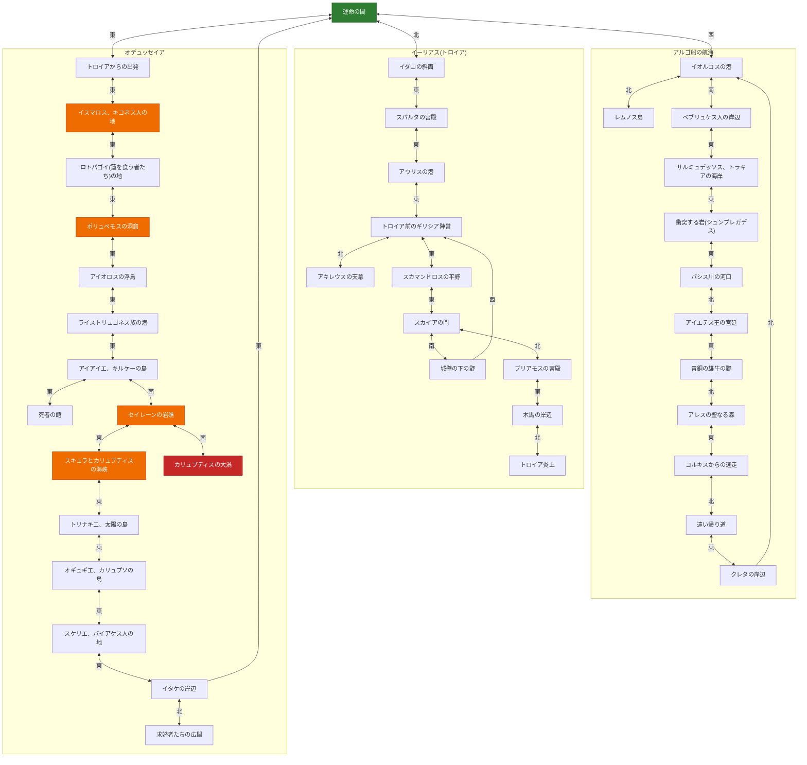
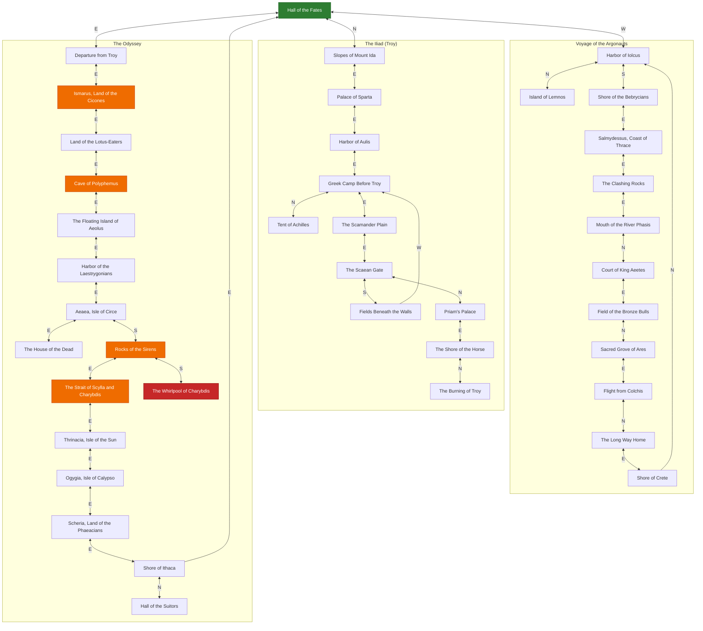

*This project has been created as part of the 42 curriculum by amakino, takawaka.*

# The Answer Protocol (TAP)

[日本語版はこちら](#日本語版) ・ [English version below](#english-original-submission)

---

# 日本語版


## 動かし方

```sh
# サーバー起動(ポート4242で待ち受け、Ctrl-Cで終了)
go run ./cmd/server

# 別ターミナルでCLIクライアント接続(デフォルトは127.0.0.1:4242)
go run ./cmd/cli
go run ./cmd/cli 127.0.0.1:4242   # ホスト:ポートを指定する場合

# バイナリとしてビルドする場合
go build -o server ./cmd/server && ./server
go build -o cli ./cmd/cli && ./cli
```

CLIは「生プロトコルをそのまま中継する」方針(打った行がそのままサーバーに送られ、サーバーの応答行がそのまま表示される)。最初のコマンドは必ず`CONNECT <name>`。日本語版で遊びたい場合は、`CONNECT`より前に`LANG ja`を送る(8章参照)。

```
$ go run ./cmd/cli
Connected to 127.0.0.1:4242
OK hello proto=1
LANG ja
OK lang=ja
CONNECT alice
OK connected
LOOK
OK {"room":{...,"name":"運命の間",...}, ...}
```

## コマンド一覧

RFC 15コマンド + 独自拡張2つ(`FLEE`・`LANG`、下表に明記)。正式な仕様は`protocol-rfc.html` 5章、英語セクションの[Command list](#command-list)も参照。

| コマンド | 構文 | 内容 |
|---|---|---|
| `CONNECT` | `CONNECT <name>` | `<name>`で認証。`LANG`を送る場合を除き最初に送るコマンド。 |
| `LANG`(独自) | `LANG <en\|ja>` | このコネクションのストーリー言語を選択。**`CONNECT`より前**に送ること。 |
| `LOOK` | `LOOK` | 現在の部屋(名前・説明・プレイヤー・アイテムID・NPC ID・出口)を取得。 |
| `MOVE` | `MOVE <方向>` | 出口を通って移動(例: `MOVE east`)。 |
| `TAKE` | `TAKE <アイテムIDまたは名前>` | 部屋にあるアイテムを取得。 |
| `DROP` | `DROP <アイテムIDまたは名前>` | 所持品を部屋に置く。 |
| `INVENTORY` | `INVENTORY` | 所持品一覧。 |
| `TALK` | `TALK <NPC IDまたは名前>` | 部屋にいるNPCと話す。 |
| `ATTACK` | `ATTACK <NPC IDまたは名前>` | 敵NPCを攻撃。 |
| `FLEE`(独自) | `FLEE` | 現在の戦闘から離脱。戦闘中のみ有効。 |
| `STATUS` | `STATUS` | 自分のHP・戦闘状態を確認。 |
| `QUEST` | `QUEST <NPC IDまたは名前>` | そのNPCが持つクエストを受注。 |
| `QUESTS` | `QUESTS` | これまで受注した全クエストと進行状況を一覧表示。 |
| `CHAT` | `CHAT <GLOBAL\|ROOM\|GROUP> <メッセージ>` | 指定した範囲にチャット送信。 |
| `WHO` | `WHO` | 現在の接続プレイヤー数。 |
| `GROUP` | `GROUP CREATE` / `GROUP INVITE <name>` / `GROUP JOIN <leader>` / `GROUP LEAVE` | `CHAT GROUP`用のグループ管理。 |
| `QUIT` | `QUIT` | 正常に切断する。 |
CHAT GLOBAL 死ね死ねchatGPTよりclaudeのほうが頭いい
attack npc.polyphemus
## テストの実行

```sh
go vet ./...
gofmt -l .            # 何も出なければOK
go test ./...
go test -race ./cmd/server/...
```

特定のテストだけ実行したいとき:
```sh
go test ./cmd/server/... -run TestOdysseyArcAgainstRealWorldData -v
```

## 各システムの概要

英語セクションの各見出し([Architecture](#architecture)、[Protocol Implementation](#protocol-implementation)、[Combat System](#combat-system)、[Quest System](#quest-system)、[World Design](#world-design)、[Server Logging](#server-logging))に詳しく書いてあるので、ここでは要点だけ:

- **並行モデル**: 接続ごとに1 goroutine + サーバー状態全体を単一の`sync.Mutex`で保護、という単純な方式。実装の正しさを優先した(`memo.md` 2章)。
- **戦闘**: ATTACKは基本8〜14ダメージ・反撃6〜12ダメージのランダム。一部の敵は「正しいアイテム/達成済みクエスト」を持っていないとATTACKで即死する「神話ゲート」付き。HP0で運命の間にHP20でリスポーン。**生きている敵がいる部屋はMOVEで出ようとすると即死**(倒すかFLEEで振り切るまで封鎖)。
- **クエスト**: `QUEST <npc>`で受注、TAKE/ATTACKの成否をサーバー側が自動で判定して進行・達成・報酬付与まで行う(完了報告コマンドは無し)。
- **ワールド**: 40部屋・アイテム17種・NPC 40強・クエスト11種。アルゴナウタイ編はクレタ→イオルコスでループし、ハブ部屋は3分岐なので、「ループ+分岐、一直線不可」の要件を満たす。オデュッセイア編も単独で輪になっている(ハブから東へ進み、イタケの岸辺の東の出口でハブに戻る14部屋)。冥界・カリュブディスの大渦・求婚者たちの広間は、そこから分かれる行き止まりの枝。
- **多言語対応**: `LANG ja`をCONNECT前に送るとLOOK/TALK/QUESTのテキストが日本語になる。RFC規定のJSON構造・コマンド名は一切変更していないので、他チームのサーバー/クライアントとの相互接続には影響しない。詳細は`memo.md` 8章。

### ワールドの地図

全40部屋とその出口を `data/world.json` から生成した図。矢印の文字は、上の部屋から下の部屋へ進むときの方角(戻るときは逆方向)。`<-->` は往復できる道、`-->` は一方通行(クレタ→イオルコス、城壁の下の野→ギリシア軍の陣営、イタケの岸辺→運命の間)。緑がハブ、橙は仲間を失う/適切なアイテムが無いと死ぬ危険のある部屋、赤は入ると必ず死ぬ部屋。



## チーム分担

- **takawaka**: サーバーの土台(TCP受付・行単位ディスパッチ、CONNECT/LOOK/MOVE、CHAT、GROUP、アイテムの永続化)とCLIクライアント
- **amakino**: ワールド・ストーリー設計、RFC/課題分析(`TASKS.md`/`memo.md`)、戦闘・クエスト・ハザード・クルーシステムの設計と実装、神話ゲートのデータ設計、多言語対応

---

# English (Original Submission)

## Description

**The Answer Protocol (TAP)** is a shared-world, multiplayer, text-based adventure (MUD): a single TCP server (`cmd/server`) plus a CLI client (`cmd/cli`), built strictly against the attached RFC (`rfc.tar.gz` / `protocol-rfc.html`) so that our server and client can interoperate with any other team's implementation of the same protocol.

The world retells three Greek myths — the Voyage of the Argonauts, the Iliad, and the Odyssey — as three branching story arcs that share a single hub room (`loc.hall_of_fates`, the Hall of the Fates). On top of that world, we designed an original combat and quest system around one idea, left deliberately undefined by the RFC (see "Combat System" below): **acting against the myth gets you killed.** For example, attacking Polyphemus without first taking the sharpened olive stake is an instant kill, not a normal fight.

A GUI client (`cmd/gui`) has not been started yet (the directory only holds a placeholder). Structured JSON logging (per-command/response audit logs, abuse-pattern detection) is also not implemented yet; see "Server Logging" for what exists today. These are this project's two most significant known gaps.

## Instructions

The server listens on TCP port 4242 and speaks the line-oriented TAP protocol described in `protocol-rfc.html`. Any RFC-compliant client — ours or another team's — can connect to it, and our CLI client can connect to any RFC-compliant server.

Our CLI client is a **raw protocol relay**: every line you type is sent to the server unmodified, and every line the server sends back is printed unmodified. We chose this over a "friendly commands translated to protocol" client because it keeps the client trivial and lets anyone see exactly what is going over the wire, which matters for debugging interop with other teams (see "Building and Running" for how to start it).

### Command list

All 15 RFC commands, plus our two additive extensions (`FLEE`, `LANG`, both marked below). Full request/response/error shapes are in `protocol-rfc.html` §5; this is a quick reference.

| Command | Syntax | What it does |
|---|---|---|
| `CONNECT` | `CONNECT <name>` | Authenticate as `<name>`. Must be the first command after `LANG` (if any). |
| `LANG` *(custom)* | `LANG <en\|ja>` | Choose the story language for this connection. Must be sent **before** `CONNECT`. |
| `LOOK` | `LOOK` | Current room: name/description, players, item IDs, NPC IDs, exits. |
| `MOVE` | `MOVE <direction>` | Move through an exit (e.g. `MOVE east`). |
| `TAKE` | `TAKE <item id or name>` | Pick up an item present in the room. |
| `DROP` | `DROP <item id or name>` | Drop an item from your inventory into the room. |
| `INVENTORY` | `INVENTORY` | List the items you're carrying. |
| `TALK` | `TALK <npc id or name>` | Talk to an NPC in the room. |
| `ATTACK` | `ATTACK <npc id or name>` | Attack an enemy NPC. |
| `FLEE` *(custom)* | `FLEE` | Retreat from your current fight. Only valid while in combat. |
| `STATUS` | `STATUS` | Your current HP and combat status. |
| `QUEST` | `QUEST <npc id or name>` | Request the quest offered by that NPC. |
| `QUESTS` | `QUESTS` | List every quest you've started, with progress. |
| `CHAT` | `CHAT <GLOBAL\|ROOM\|GROUP> <message>` | Send a chat message in that scope. |
| `WHO` | `WHO` | Number of players currently online. |
| `GROUP` | `GROUP CREATE` / `GROUP INVITE <name>` / `GROUP JOIN <leader>` / `GROUP LEAVE` | Party management for `CHAT GROUP`. |
| `QUIT` | `QUIT` | Disconnect cleanly. |

Minimal example session (after connecting):

```
OK hello proto=1
CONNECT alice
OK connected
LOOK
OK {"room":{"id":"loc.hall_of_fates","name":"Hall of the Fates","description":"Outside time itself, the three Moirai spin, measure, and cut the thread of every hero's life. Three great tapestries hang before you, each depicting a different age of heroes.","exits":{"east":"loc.ody_troy_shore","north":"loc.troy_ida","west":"loc.argo_iolcus"}},"players":["alice"],"items":[],"npcs":[]}
MOVE east
OK room=loc.ody_troy_shore
STATUS
OK {"hp":100,"max_hp":100,"status":"healthy"}
QUIT
OK bye
```

To play the Japanese-language version of the story, send `LANG ja` **before** `CONNECT` (it is rejected once you are connected as a player — language is chosen at the start of a session, not switched mid-game):

```
LANG ja
OK lang=ja
CONNECT alice
OK connected
LOOK
OK {"room":{"id":"loc.hall_of_fates","name":"運命の間","description":"時そのものの外側で...","exits":{...}},...}
```

All 15 RFC commands work identically regardless of language; only story text (room/NPC/quest text) changes.

## Resources

- The protocol specification: `protocol-rfc.html` (from `rfc.tar.gz`), the "42TAP" RFC supplied with the subject.
- Go standard library only — `net`, `encoding/json`, `bufio`, `log`, `sync`, `math/rand/v2`, etc. `go.mod` declares no third-party dependencies.
- **AI assistance**: Claude (Anthropic) was used throughout this project as a coding/design assistant, with all output reviewed, built, and tested by the team before committing. Specifically, AI assistance was used for: reading and summarizing the subject PDF and RFC into `TASKS.md` and `memo.md` at the start of the project; collaboratively designing the combat/quest/crew/myth-gate game systems described below; implementing the corresponding Go code (`combat.go`, `quest.go`, `hazard.go`, `odyssey.go`, `locale.go`) and its automated tests; authoring the Japanese localization text in `data/world.json`; and writing this README.

## Architecture

- **Dispatch**: `cmd/server/server.go` maps each command name to a handler function (`commandHandlers map[string]commandHandler`). `main.go` calls `net.Listen("tcp", ":4242")` and spawns one goroutine per accepted connection (`go server.handleClient(conn)`); each connection's goroutine reads newline-delimited commands with `bufio.Scanner` and dispatches them in a loop, one at a time.
- **Concurrency model**: goroutine-per-connection, with all shared game state (connected players, the world, groups) guarded by a single `sync.Mutex` (`Server.mu`). We picked this over an event-loop/epoll design because it is far simpler to reason about and to keep correct under the RFC's strict interop requirement (memo.md §2 "並行モデルの選択"); the tradeoff is that it will not scale to very high connection counts as gracefully as an async design would, which we judged acceptable for this project's scope. A second, separate mutex (`Server.ioMu`) serializes on-disk persistence (`playerdata.json`, item locations) so that disk I/O never blocks in-memory game state under `Server.mu`.
- **Non-blocking broadcast**: each connection owns an asynchronous outbound write queue (`client_conn.go`, a buffered channel drained by a dedicated `writeLoop` goroutine). Handlers enqueue a response or event and return immediately; they never write to the socket while holding `Server.mu`. This means broadcasting an event to every player in a room is O(number of players) non-blocking enqueues rather than blocking network writes, and one slow/stalled client cannot stall the mutex for everyone else.
- **Package layout**:
  - `server.go` — command dispatch table, connection lifecycle, LOOK/MOVE/CONNECT/QUIT/TAKE/DROP/INVENTORY/TALK/STATUS
  - `combat.go` — ATTACK/FLEE and the myth-gate/damage logic
  - `quest.go` — QUEST/QUESTS and automatic objective tracking
  - `hazard.go` — room-entry hazards (lethal / item-gated / crew-gated exits)
  - `odyssey.go` — Odyssey-arc-specific item side effects (lotus fruit, bag of winds) and crew initialization
  - `locale.go` — `LANG` command and `LocalizedText`/`roomView` localization plumbing
  - `notify.go` — private per-player events (`EVT PLAYER ...`): death reasons, the Hall of the Fates guide, and quest notices
  - `endings.go` — the three per-arc endings and the final ending (`Ending` in `data/world.json`, triggered by `TALK`)
  - `hardcore.go` — the death penalty (lose your belongings) and the co-op rules (allies in the same `GROUP` and room)
  - `flavor.go` — `EVT ROOM COMBAT` narration, expanded per recipient in that recipient's `LANG` language
  - `chat.go` / `group.go` — CHAT (GLOBAL/ROOM/GROUP) and GROUP management
  - `world.go` / `room.go` / `player.go` — the world data model, JSON loading, and validation
  - `item_store.go` / `player_store.go` — on-disk persistence of item locations and player state

## Protocol Implementation

All 15 RFC commands are implemented: `CONNECT, LOOK, MOVE, CHAT, TAKE, DROP, INVENTORY, TALK, ATTACK, STATUS, QUEST, QUESTS, WHO, GROUP, QUIT`, with the response/error shapes and error codes defined in `protocol-rfc.html` §5. Input is validated for UTF-8 validity, control characters, and the 1024-byte practical line-length ceiling suggested by the RFC (`maxProtocolLineBytes`); TCP message splitting/coalescing is handled by buffering with `bufio.Scanner` rather than assuming one read equals one command.

We added a small number of **additive** extensions. None of them change the shape or meaning of any RFC-defined command, response, or event, so an RFC-only client from another team continues to interoperate with our server without modification, and our client works against a plain RFC-only server (it simply never sends the extra commands):

- **`FLEE`** — a combat command with no arguments, retreating from the player's current fight. The RFC explicitly names `FLEE` as an example of a team-defined combat extension (§6.1.1).
- **`LANG <code>`** — must be sent before `CONNECT`; selects the language (`en`, the default, or `ja`) that this connection's story text (room/NPC/quest text) is returned in for the rest of the session. Sending it after `CONNECT` returns `ERR 400 BAD_REQUEST`, since language is a start-of-session choice, not a runtime setting. See "World Design" / `memo.md` §8 for the full localization design.
- **`EVT ROOM COMBAT <text>`** — a new event *type*, not a new event *format*: the RFC's event grammar (`event-line = "EVT" SP event-type SP event-data LF`) does not close off the set of valid event-type tokens, so a well-behaved client that only recognizes the RFC's own event types (`ROOM PRESENCE ...`, `ROOM CHAT ...`, etc.) can safely ignore an unrecognized `COMBAT` type rather than fail to parse it. We use it to broadcast combat/hazard flavor text to everyone in the room.
- **`EVT PLAYER <kind> <text>`** — a second new event type, sent to **one player only** (unlike `EVT ROOM COMBAT`, which goes to everyone in a room). It exists because a dying player is teleported back to the Hall of the Fates *before* the room broadcast is sent, so they never saw why they died. `<kind>` is `DEATH` (what killed you, what you lost, where you woke up and with how much HP), `ENDING` (the story endings and what is still missing for them), `TEAM` (an ally shared a kill with you), `GUIDE` (the Hall of the Fates tutorial, see "World Design") or `QUEST` (a quest-giver is in the room / progress / completion, see "Quest System"). Text is in the language chosen with `LANG`. As with `COMBAT`, an RFC-only client can safely ignore the unknown `PLAYER` type.
- **`ERR 407 NOT_IN_COMBAT`** — a new error code (the RFC defines up to `406`), returned by `FLEE` when the player isn't currently fighting anything.
- **No new fields on any RFC-defined JSON response.** In particular, our internal `Crew` resource (see "World Design") is deliberately kept out of `STATUS`/`ATTACK`'s JSON bodies, even though the RFC does not explicitly forbid extra JSON keys — we didn't want to gamble on how strictly another team's JSON parser is written. It is only ever revealed as plain narrative text over `EVT ROOM COMBAT`.

## Combat System

RFC §6.1.1 leaves damage calculation, turn/initiative handling, combat state transitions, and any additional commands entirely up to each team, while fixing only the `ATTACK`/`STATUS` request/response shapes. Our design axis for all of it is: **the world punishes acting against the myth**, not just raw stat-checking. Concretely:

- **Baseline numbers.** Players start at 100 HP (`STATUS`'s `max_hp`). A successful `ATTACK` deals a uniformly random 8–14 damage to the target; if the target survives, it counters for a uniformly random 6–12 damage back at the attacker. There is no explicit initiative system beyond "the attacker's `ATTACK` resolves, then the defender's counter resolves in the same round" — we judged a separate initiative roll unnecessary complexity for a text MUD at this scope.
- **Myth gates.** Some `enemy`-role NPCs require the player to be holding a specific item (`myth_requirement_item` in `data/world.json`) or to have completed a specific quest (`myth_requirement_quest`) before `ATTACK` engages in ordinary combat at all; without it, `ATTACK` is an instant kill (`{"status":"dead", ...}`), and the player respawns exactly as on any other death. For example: Polyphemus requires the sharpened olive stake; Talos requires the `quest.golden_fleece` quest to be completed (Medea's magical aid); the suitors require Odysseus's strung bow. This mirrors how each of these fights is actually won in the myths — force alone never works.
- **FLEE.** Each NPC declares whether fleeing from it is myth-accurate. Some (Polyphemus, the Laestrygonians) always let the player flee successfully, matching the myth. Most default to always failing (a counter-attack lands). Hector is a special case: `FLEE` against him succeeds exactly **once, ever** (tracked per-player, per-NPC, and it does *not* reset if you re-engage him later) — a nod to his three laps around Troy's walls before he finally turns to fight Achilles — and always fails after that.
- **Unwinnable fights.** (Fixed: `FLEE` used to answer `ERR 407` unless a fight was already running, but `ATTACK` against an unwinnable enemy never starts one, so this room was a true softlock. `FLEE` now also works against the enemy blocking the current room.) The Laestrygonians can never be defeated by force: `ATTACK` against them never rolls damage at all and instead costs the player's crew (see "World Design"), while `FLEE` (the historically correct choice — only Odysseus's own ship escaped by anchoring outside the harbor) always succeeds. This uses the fight to spend the crew resource narratively instead of pretending it's a winnable stat check.
- **Death and respawn.** Any death — ordinary attrition, a myth-gate instant kill, or a fatal room hazard — sets HP to 0 and respawns the player at the world's safe hub room (`loc.hall_of_fates`) with 20 HP, matching the subject's "HP 0 respawns in a safe zone, with reduced HP" requirement (`respawnPlayerLocked` in `combat.go`).
- **Logging/broadcast.** Every `ATTACK`/`FLEE` resolution is broadcast to the room via `EVT ROOM COMBAT <flavor text>`, in addition to the structured response sent to the acting player.
- **A live threat blocks the room, not just the fight.** Several room descriptions state outright that the enemy blocks passage — Amycus "blocks every crew that lands," Polyphemus's cave mouth is sealed by a boulder — but originally nothing stopped a player from just walking past a hostile NPC via `MOVE` without ever engaging it. We closed that: `MOVE` out of a room containing any live (`hp > 0`) `enemy`-role NPC the player hasn't yet defeated or successfully fled from is an instant kill (`blockingEnemyLocked` in `hazard.go`), consistent with every other myth gate in this design. A successful `FLEE` against a given NPC is remembered permanently per player (`Player.FledFrom`, keyed by NPC ID — not reset by leaving and re-entering), so once you've talked your way or run your way past something, it stays resolved. Because `Unwinnable` NPCs (the Laestrygonians) never reach 0 HP, `FLEE` is their *only* way out of the room; `TestNoEnemyIsBothUnwinnableAndUnfleeable` checks the whole roster so we can't accidentally ship an NPC that's both unwinnable and unfleeable (an unconditional softlock). Scylla was exactly this case during development — she had no `flee_accurate` set, which would have forced a fight the myth never asks for — so we gave her `flee_accurate: true`, matching how she's actually survived (you don't kill Scylla, you just get past her, at a cost already charged by the room's `crew_gate` hazard on the way in).

We did not add a `DEFEND` command: none of the myth gates we designed call for a "reduce incoming damage" mechanic, so we judged it unnecessary complexity rather than adding it just because the RFC mentions it as an example.

## Quest System

RFC §6.1.2 fixes only the `QUEST`/`QUESTS` request/response shapes and leaves objective tracking, completion, rewards, and any additional commands up to each team. Our design:

- `QUEST <npc>` looks up the quest offered by that NPC (`giver_npc_id` in `data/world.json`). The first time a player asks, the quest is marked `active` for that player; the RFC's own example response (`"status": "available"`) describes the offer itself, and is returned every time the quest hasn't been completed yet. Asking again after completion returns `ERR 406 NO_QUEST_AVAILABLE`.
- **Progress is fully automatic**, not player-reported: a successful `TAKE` checks every one of the player's `active` quests with a `collect_item` objective for that item, and a winning `ATTACK` does the same for `defeat_npc` objectives. Reaching the objective's target count marks the quest `completed` and immediately heals the player by the quest's HP reward (capped at 100). We deliberately did **not** add a `COMPLETE_QUEST` command — nearly every quest in this world is already something the player does naturally in the course of surviving (e.g. defeating Polyphemus with the stake both wins that fight and completes the trapped sailor's quest), so a manual completion step would just be extra client-side bookkeeping for no real benefit.
- `QUESTS` returns every quest the player has ever started (active or completed), each with `"progress": "<current>/<target>"`.
- **Discoverability.** `LOOK`'s response only lists NPC IDs (its shape is fixed by the RFC), so a player could not tell who had a quest. The server therefore sends `EVT PLAYER QUEST` whenever the player connects to or enters a room containing a quest-giver whose quest they have not started ("X has a request for you. Type `QUEST X`"), and again after `TALK`ing to a quest-giver (the offer, or the current progress).
- **Feedback.** Progress (`2/3`) and completion (with the HP reward) are announced with `EVT PLAYER QUEST`, so the player no longer has to run `QUESTS` to find out.
- **Items picked up before accepting.** Progress used to be counted only at the moment of `TAKE`, so taking an item *before* asking for its quest made the quest impossible to finish. Accepting a `collect_item` quest now also counts an item already in the player's inventory.
- Some quests are deliberately framed as traps rather than good advice — accepting Eurylochus's quest to slaughter the sacred cattle of Helios and doing so (`item.sacred_cattle`) kills the player instantly, matching the myth's own moral.

## Endings, Difficulty and Co-op

- **Three independent stories, three endings.** The Argonauts, Troy and the Odyssey never require anything from each other (`TestThreeArcsAreIndependent` checks every gate, quest and ending against the room prefix of what it needs). Each has a final person to `TALK` to, who checks what you carry and which quests you completed, then plays the ending as `EVT PLAYER ENDING` lines and hands over a trophy: King Pelias (bring the Golden Fleece, `ending.argo`, Laurel of the Argo), Aeneas at the burning of Troy (Trojan Horse and the four Troy quests, `ending.troy`, Ember of Troy), Penelope (Odysseus's Bow and the two Ithaca quests, `ending.odyssey`, Olive Branch of Ithaca). If something is missing they only refuse, and never list what is missing. After all three, the Moirai in the Hall of the Fates play the final ending (`ending.final`, Thread of Fate). No new command: it is `TALK`, and the RFC response shape is unchanged. Your key item is shown, not consumed.
- **Why "not enough items" happened, and the fix.** Items were unique world instances and inventories are saved, so one player picking up and abandoning the key items (a real saved account held ten of them) made every other player's route unwinnable. Items needed by a quest, a myth gate or an ending are now `renewable`: they stay in their room and each player gets their own copy (players who already hold one don't see it in `LOOK`). A few decorative items (`item.hospitality_gift`, `item.dragons_teeth`, `item.strong_wine`, `item.lotus_fruit`) stay unique, so the subject's "TAKE removes the item from the room, DROP makes it available" behaviour is still there and tested.
- **Enemies are per player.** Enemy HP lives in `Player.EnemyHP`, not in the shared NPC, so one player killing the Harpy no longer stops everybody else from fighting it or finishing a `defeat_npc` quest. Accepting a quest also counts progress you had already made (an item already in your inventory, an enemy already beaten), which used to be impossible to finish.
- **Two more softlocks fixed.** HP never regenerated (after one death you were at 20 HP forever, and the Argonauts' mandatory fights alone cost more than 100 HP), so HP now regenerates slowly (1 HP per 2 s). The Odyssey crew (needed at Scylla) was granted only once, so it is now refilled every time you enter the Odyssey from the Hall.
- **Brutal difficulty.** Death costs you every belonging except trophies: unique items go back to their home room, key-item copies vanish (fetch them again), and every enemy you wounded or escaped is reset. Enemy counter-attacks are 7-14 damage. The death message says only what killed you and what you lost: never what you were missing. Quest texts and death messages deliberately contain no hints, so what a myth gate wants has to be worked out from the myths.
- **Co-op.** In the same `GROUP`, allies standing in the same room add +5 damage each (up to 3) and reduce each counter-attack by 20% each; a kill counts for every ally in the room (including `defeat_npc` quest progress); and if you die while an ally is in the room, they protect your belongings so you lose nothing. Combat narration is localized for each recipient.

## World Design

- **Structure.** One shared hub room, the Hall of the Fates (`loc.hall_of_fates`), branches three ways into the Voyage of the Argonauts (12 rooms), the Iliad (11 rooms), and the Odyssey (17 rooms) — 40 rooms in total. The hub's own 3-way branch, plus the Argonauts arc looping back on itself (Crete → Iolcus), satisfies the "rooms form a loop and at least one branch, not a straight line" requirement. The Odyssey arc is also a loop on its own: heading east from the hub through every stop to the Shore of Ithaca, whose east exit leads back to the hub, makes a 14-room ring (hub included), with the Underworld, the Whirlpool of Charybdis and the Hall of the Suitors as dead-end branches off it.
- **NPCs.** All three required roles are represented throughout: `dialogue` (lore/flavor), `quest_giver`, and `enemy`. Well over 30 NPCs total.
- **Items.** 17 obtainable items (plus 4 reward-only trophies), nearly all of them load-bearing for either a myth gate or a quest objective (e.g. the beeswax that protects against the Sirens, the moly root that protects against Circe).
- **Quests.** 16 quests across the three arcs, every one a `collect_item` or `defeat_npc` objective (see "Quest System" for how progress/reward is handled).
- **Tutorial / guide.** The Hall of the Fates contains the Moirai, an NPC flagged `"guide": true` in `data/world.json`. The first time a player ever connects, the server plays her dialogue (basic commands, the three ways out, quests, combat, what happens on death) as `EVT PLAYER GUIDE` lines; afterwards `TALK Moirai` replays it (the first line is the RFC `OK` response, the rest are `EVT PLAYER GUIDE`). Whether the intro was already shown is stored per player (`Player.IntroSeen`).
- **Death messages.** Every way to die (counter-attack, unprepared myth gate on `ATTACK` or `TALK`, failed `FLEE`, leaving a room with a live enemy, lethal/item/crew hazards, the lotus, the cattle of Helios) sends the dying player an `EVT PLAYER DEATH` explaining the cause, and where they respawned (`notify.go`, `respawnPlayerLocked`).
- **Room hazards** (`hazard.go`), separate from NPC combat, gate certain rooms on entry via `MOVE`:
  - `lethal` — always fatal (the whirlpool of Charybdis: the myth gives no way to survive it).
  - `item_gate` — fatal without a specific item (the Sirens' rocks, without beeswax).
  - `crew_gate` — costs a fixed amount of crew on entry, and is fatal outright if the player doesn't have enough crew left to absorb the loss (Scylla, requiring `crew + 1 ≥ 7` to survive losing 6 crew — mirroring how Scylla takes exactly six of Odysseus's men but never the ship itself).
  - `crew_cost` — unconditionally costs a fixed amount of crew on entry, never fatal (the Cicones' counter-raid and Polyphemus's cave, both −2, matching each room's own description of losses that already happened before the player arrives).
- **Crew resource** (Odyssey arc only). The player is granted a crew of 12 (`Player.Crew`) the moment they first set foot in the Odyssey arc (`loc.ody_troy_shore`). It represents the companions accompanying Odysseus and is spent — not the player's own HP — by specific bad choices: entering the Cicones' land (−2) or Polyphemus's cave (−2), opening the bag of winds anywhere but Ithaca (−3), being attacked by the Laestrygonians (−8), and passing Scylla (−6, unavoidable). Eating the lotus fruit is *not* a crew cost — it's an instant kill (see "Combat System"'s myth gates, `applyTakeConsequencesLocked` in `odyssey.go`): the myth has whoever tastes it simply never choose to leave, which we judged closer to a death than a toll. Crew is never exposed in any RFC-defined JSON response (see "Protocol Implementation"); the player only learns about it through `EVT ROOM COMBAT` narration and their own play. Kept purely in `Player` (server-side, and persisted per-player like the rest of that struct).
- **Circe/Sirens are engagement-gated, not entry-gated**, for one deliberate reason: `item.moly`, the item that protects against Circe, is located *inside* her own room. A room-entry hazard would kill the player before they could ever pick it up. So Circe's gate instead triggers on `TALK` (the moment the player actually engages her), which also better matches the myth — simply walking onto her island was never dangerous; drinking her cup was.

### Room map

All 40 rooms and their exits, generated from `data/world.json`. Each edge is labelled with the direction you take when moving from the upper room to the lower one (the way back is the opposite direction). `<-->` is a two-way connection; `-->` is one-way (Crete → Iolcus, Fields Beneath the Walls → Greek Camp, Shore of Ithaca → Hall of the Fates). Green is the hub, orange rooms have a hazard that costs crew or kills without the right item, and red rooms are always fatal.



## Server Logging

Everything is logged as **structured JSON, one object per line**, with Go's standard `log/slog` (`cmd/server/logging.go`). Every record has a nanosecond-precision RFC 3339 `time`, a `level` (`INFO`, `WARN` or `ERROR`; `DEBUG` when enabled) and a `msg` naming the event type. Output goes to **stderr**; set `TAP_LOG_FILE=path` to also append the same records to a file, and `TAP_LOG_LEVEL=debug|info|warn|error` to change the threshold (`debug` also logs every `EVT` line sent). Logging is a synchronous write of a small JSON line, so it does not noticeably slow the server.

| What the subject requires | Event (`msg`) | Level | Main fields |
| --- | --- | --- | --- |
| Connections and disconnections with timestamps and IP | `connection_open`, `connection_close`, `player_quit` | INFO | `remote` (`ip:port`), `player`, `duration_ms` |
| Every command received | `command` | INFO | `remote`, `player` (empty before `CONNECT`), `command`, `args` (clipped to 300 characters) |
| Every response and error code sent | `response` (`OK ...`), `error_response` (`ERR ...`) | INFO / WARN | `remote`, `player`, `command`, `code` (errors), `line`. Logged at the single point where bytes are written (`writeLoop`), so no response can be missed |
| World state changes | `item_taken`, `item_dropped`, `player_moved`, `npc_interaction`, `combat_attack`, `combat_flee`, `player_died`, `victory_shared` | INFO | `player`, `item` / `npc` / `room`, combat `status`, `damage`, HPs, death `cause` and what happened to the belongings |
| Quest progress and completion | `quest_accepted`, `quest_progress`, `quest_completed`, `ending_reached` | INFO | `player`, `quest` / `ending`, `progress`, `target`, `reward_hp` |
| Abuse patterns | `abuse_command_flood`, `abuse_rapid_connections` | WARN | see below |
| Failures | `save_player_failed`, `drop_item_failed`, `encode_response_failed`, ... | ERROR | `error` |

**Abuse monitoring.** The server only observes and logs; it never disconnects anyone. A connection that sends more than 20 commands within one second produces `abuse_command_flood` (at most once per 5 seconds per connection). More than 8 connections from one IP within 10 seconds produces `abuse_rapid_connections` (at most once per 5 seconds per IP). To watch the server live, run `make run-server` and pipe it through a JSON tool, for example `make run-server 2>&1 | jq -c 'select(.level != "INFO")'` shows only warnings and errors, and `jq 'select(.player == "alice")'` follows one player.

## Group Contributions

Reconstructed from `git log`; please double-check and expand this section yourselves before final submission.

- **takawaka** built the initial server framework: the TCP accept loop and line-based command dispatch, `CONNECT`/`LOOK`/`MOVE`, `CHAT` (`GLOBAL`/`ROOM`/`GROUP`), `GROUP` management, item pickup/drop persistence (`item_store.go`, `player_store.go`), and the CLI client (`cmd/cli`), along with their test suites.
- **amakino** wrote the world/story content across all three arcs (`data/world.json`), the subject/RFC analysis notes (`TASKS.md`, `memo.md`), and designed and implemented the combat/quest/hazard/crew game systems (`combat.go`, `quest.go`, `hazard.go`, `odyssey.go`), the myth-gate data for every enemy/gated NPC, the `LANG`/localization system (`locale.go`) and the Japanese translations in `data/world.json`, and the corresponding automated tests.

## Building and Running

Run these from the repository root — the server loads `data/world.json` and reads/writes `saves/` using relative paths. A `Makefile` wraps everything (`make help` lists the targets):

| Target | What it does |
| --- | --- |
| `make install` | download the Go module dependencies (`go mod download`) |
| `make build` | compile the server, CLI client and GUI client into `bin/` |
| `make run-server` | run the server on `:4242` (JSON logs on stderr) |
| `make run-client` | run the CLI client; `make run-client ADDR=host:port` for another server |
| `make run-client-gui` | run the GUI client |
| `make lint` | fail if any file needs `gofmt`, then run `go vet ./...` |
| `make test` | run all automated tests |
| `make clean` | remove `bin/` (the `saves/` directory is kept) |

The same commands without `make`:

```sh
go run ./cmd/server                    # starts the server on :4242
go run ./cmd/cli 127.0.0.1:4242        # CLI client (host:port optional)
go run ./cmd/gui                       # GUI client
go vet ./... && gofmt -l .             # lint (gofmt prints nothing if all is formatted)
```

## Testing

```sh
go test ./...                           # full suite (cli + server)
go test -race ./cmd/server/...          # with the race detector
go test ./cmd/server/... -run TestName -v   # a single test, verbose
```

The server package's test suite covers, among other things: the full connection/auth lifecycle and disconnect/reconnect persistence; every RFC command's success and error paths; TCP message splitting/coalescing; concurrent multi-client scenarios (room presence, chat scopes, groups); world-data validation (`TestLoadWorldData` loads the real `data/world.json`); and, specific to this project's combat/quest/localization design, integration tests that exercise every myth-gate NPC and room hazard **against the real `data/world.json`** (not just a synthetic test world) in both English and Japanese — `TestOdysseyArcAgainstRealWorldData`, `TestArgonautsAndTroyMythGatesAgainstRealWorldData`, and `TestJapaneseTranslationsAgainstRealWorldData`.
